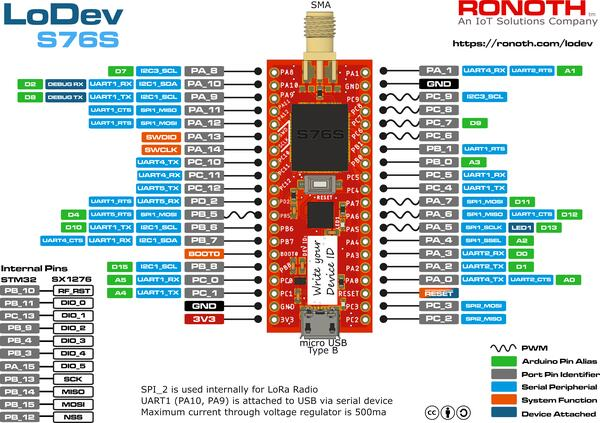

.. zephyr:board:: ronoth_lodev

========
Overview
========

The Ronoth_ LoDev_ is a small open source board containing a `AcSIP S76S`_  SiP from AcSIP_.
The `full LoDev design details`_ are available on GitHub.  The LoDev_ board can be purchased
from Ronoth_ or from CrowdSupply_.

The S76S contains an STMicro STM32L073RZ MCU, a `Semtech SX1276`_ LoRaWAN transceiver,
and a +20 dBm power amplifier.  Refer to `AcSIP S76S Product Information Brief`_ for details.

Zephyr applications may use the **ronoth_lodev** configuration to run on this board.

`Board design files`_ are available on GitHub.

================
Device Resources
================

The embedded STMicro STM32L073RZ has some GPIOs and SPI2 internally committed to the LoRaWAN
transceiver operation.  See `internally dedicated ports`_ for a list of resources committed to this function.

=========
Debugging
=========

Programming and debugging uses the SWD port, as on any STM32 processor.  An ST-LINK/V2 adapter
may be used with the appropriate software (*st-utils* package on Linux).

=================
Connector Pin-Out
=================

The LoDev has two rows of headers.  Pin 1 on both connectors is closest to the micro-USB connector on the board,
furthest from the RF (antenna) connector.

When viewed from the top (component) side of the board, with the micro-USB connector closest and RF (antenna)
connector furthest away, the CN6_ connector is on the left, the CN7_ connector is on the right.

UART1 on the S76S SiP is connected to a USB-to-UART device connected to the micro USB connector, so generally
PA9 and PA10 are unavailable for I/Os.

A helpful silkscreen legend is provided on the board.

     Ronth LoDev Pinout

.. _CN6:

-----------
CN6 Pin-Out
-----------

=== ======== ======================================================
Pin Function Note
=== ======== ======================================================
1   3.3V     Output 500 mA max
2   GND
3   PC1
4   PC0
5   PB8
6   BOOT0
7   PB7
8   PB6
9   PB5
10  PD2
11  PC12
12  PC11
13  PC10
14  PA14     SWCLK
15  PA13     SWDIO
16  PA12
17  PA11
18  PA9      USB serial Tx drives this pin (input) for UART1
19  PA10     USB serial Rx is driven by this pin (output) for UART1
20  PA8
=== ======== ======================================================

.. _CN7:

-----------
CN7 Pin-Out
-----------

=== ======== ============================
Pin Function Note
=== ======== ============================
1   PC2
2   PC3
3   nRESET
4   PA0
5   PA2
6   PA3
7   PA4
8   PA5
9   PA6
10  PA7
11  PC4
12  PC5
13  PB0
14  PB1
15  PC6
16  PC7
17  PC8
18  PC9
19  GND
20  PA1      Used in S76S as “RF FEM CPS”
=== ======== ============================

.. _internally dedicated ports:

--------------------------
Internally Dedicated Ports
--------------------------

======== ======== ============= ==== =========================
Pin name Pin Type I/O Structure Note Function
======== ======== ============= ==== =========================
PA15     I/O      FT            -    INTERNAL SX1276 D5
PB3      I/O      FTf           -    INTERNAL SX1276 D4
PB4      I/O      FTf           -    INTERNAL SX1276 D3
PB9      I/O      FTf           -    INTERNAL SX1276 D2
PB10     I/O      FT            -    INTERNAL SX1276 Reset
PB11     I/O      FT            -    INTERNAL SX1276 D0
PB12     I/O      FT            -    INTERNAL SX1276 SPI nCS
PB13     I/O      FTf           -    INTERNAL SX1276 SPI2_SCK
PB14     I/O      FTf           -    INTERNAL SX1276 SPI2_MISO
PB15     I/O      FT            -    INTERNAL SX1276 SPI2_MOSI
PC13     I/O      FT            -    INTERNAL SX1276 D1
======== ======== ============= ==== =========================

==========
References
==========

.. _Ronoth: https://ronoth.com/

.. _LoDev: https://ronoth.com/products/lodev-s76s-lora-soc-development-board?variant=31608819417220

.. _AcSIP: http://www.acsip.com.tw

.. _AcSIP S76S: http://www.acsip.com.tw/index.php?action=products-detail&fid1=11&fid2=29&fid3=27&id=79&lang=3

.. _AcSIP S76S Product Information Brief: https://www.acsip.com.tw/index.php?action=download_pro&perm=d&id=365

.. _CrowdSupply: https://www.crowdsupply.com/ronoth/lodev

.. _full LoDev design details: https://github.com/ronoth/LoDev

.. _Board design files: https://github.com/ronoth/LoDev

.. _posted on MBed by Steve Osborn: https://os.mbed.com/users/steve918/

.. _Semtech SX1276: https://www.semtech.com/products/wireless-rf/lora-transceivers/sx1276

=======
License
=======

This document Copyright (c) 2021 Dean Weiten <dmw@weiten.com>

SPDX-License-Identifier: Apache-2.0
