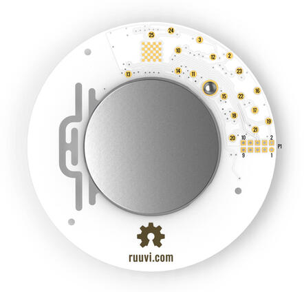

.. zephyr:board:: ruuvi_ruuvitag

Overview
********

RuuviTag is an advanced battery-operated open-source Bluetooth
enabled sensor beacon platform capable of sending temperature, humidity,
pressure, and motion information over Bluetooth Low Energy.

More information about the board can be found at the
`ruuvitag website`_.

Hardware
********

RuuviTag's have the following physical features:

* Nordic Semiconductor nRF52832 System-on-Chip
* STMicroelectronics LIS2DH12 accelerometer
* Bosch BME 280 temperature + relative air humidity + air pressure sensor
* NFC™-A tag antenna
* 1000mAh CR2477 battery
* 2 buttons
* 1 Green LED
* 1 Red LED
* IP67 Enclosure
* Long range RF antenna

Supported Features
==================

.. zephyr:board-supported-hw::

Connections and IOs
===================

LED
---

* LED0 (red) = P0.17
* LED1 (green) = P0.19

Push buttons
------------

* BUTTON0 = SW1 = P0.13

Pin descriptions
----------------

* 2 = P0.29 = SPI_SCK
* 3 = P0.28 = SPI_MISO
* 10 = P0.04 = GPIO (can be used as a GPIO / ADC pin)
* 11 = P0.05 = GPIO (can be used as a GPIO / ADC pin)
* 12 = P0.25 = SPI_MOSI
* 13 = P0.19 = LED2 (green) / GPIO (can be used as a GPIO pin but the LED will blink)
* 14 = P0.17 = LED1 (red) / GPIO (can be used as a GPIO pin but the LED will blink)
* 15 = P0.13 = Button / GPIO (can be used as a GPIO pin)
* 16 = GND (Battery's negative contact)
* 17 = Battery's positive contact
* 18 = Battery's positive contact
* 19 = SWDIO
* 20 = SWDCLK
* 21 = P0.18 = SWO / GPIO (can be used as a GPIO pin)
* 22 = P0.21 = Reset / GPIO (can be used as a GPIO pin if no need to reset the device)
* 23 = GND (Battery's negative contact)
* 24 = P0.31 = GPIO (can be used as a GPIO / ADC pin)
* 25 = P0.30 = GPIO (can be used as a GPIO / ADC pin)

GPIO = General Purpose Input Output pin

P1 = Standard 10-pin ARM Cortex debug connector (on RuuviTag Rev.B1-B5)

* 1 = VDD
* 2 = SWDIO
* 3 = GND (Battery's negative contact)
* 4 = SWDCLK
* 5 = GND (Battery's negative contact)
* 6 = SWO
* 7 = No Connect
* 8 = No Connect
* 9 = GND (Battery's negative contact)
* 10 = Reset

P1 = TC2030 TagConnect (on RuuviTag Rev.B6)

* 1 = Battery's positive contact
* 2 = SWDIO
* 3 = Reset
* 4 = SWDCLK
* 5 = GND (Battery's negative contact)
* 6 = SWO

Programming and Debugging
*************************

Flashing
========

Build and flash applications as usual (see :ref:`build_an_application` and
:ref:`application_run` for more details).

The easiest way to flash Zephyr onto a RuuviTag requires an external Ruuvi DEVKIT. More information about the board can be found at the
`ruuvitag devkit`_.

Once your tag is connected to the DEVKIT and connected to your PC, build and flash the application in the usual way.

.. zephyr-app-commands::
   :zephyr-app: samples/basic/blinky
   :board: ruuvi_ruuvitag
   :goals: build flash

Advanced users may want to program the RuuviTag without the DEVKIT, this can be achieved via the SWDIO and SWDCLK pins located on the back of the RuuviTag.

Debugging
=========

If using the Ruuvi DEVKIT refer to the :ref:`nordic_segger` page to learn about debugging Nordic boards with a
Segger IC.

Testing the LEDs and buttons on the RuuviTag
********************************************

There are 2 samples that allow you to test that the buttons (switches) and LEDs on
the board are working properly with Zephyr:

* :zephyr:code-sample:`blinky`
* :zephyr:code-sample:`button`

You can build and flash the examples to make sure Zephyr is running correctly on
your board. The button and LED definitions can be found in :file:`boards/ruuvi//ruuvi_ruuvitag/ruuvi_ruuvitag.dts`.

References
**********

.. target-notes::

.. _ruuvitag website: https://ruuvi.com
.. _ruuvitag datasheet: https://ruuvi.com/files/ruuvitag-tech-spec-2019-7.pdf
.. _ruuvitag devkit: https://lab.ruuvi.com/devshield/
