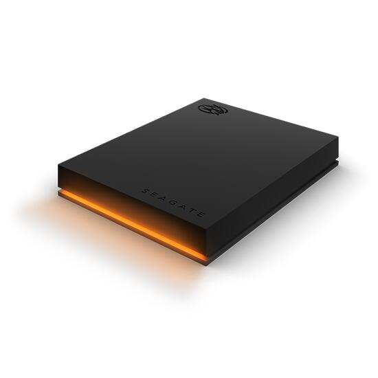
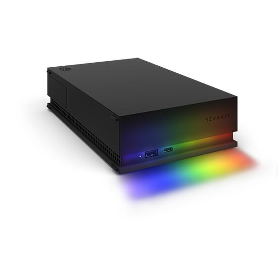

.. zephyr:board:: legend

Overview
********
The Legend board family contains three revisions: 25hdd, 25ssd, and 35.

The Legend 2.5" HDD board (revision 25hdd) can be found in the Seagate FireCuda
Gaming Hard Drive, Gaming Drive for Xbox and Gaming Drive for PlayStation
devices. A 2.5" drive and two chips are embedded: an ASMedia ASM1153 USB-to-SATA
bridge controller and a STM32F070 MCU. The former is handling the USB to HDD I/Os
while the latter is dedicated to the LED effects. The two chips are connected
together through I2C.

The Legend 2.5" SSD board (revision 25ssd) is found in the Seagate SSD Gaming
Drive for Xbox. A Realtek RTS5411S USB hub is embedded and connected to a Phison
U17 2.5" SSD, as well as a STM32F070 MCU.

The Legend 3.5" board (revision 35) can be found in the Seagate FireCuda Gaming
Hub and Gaming Drive Hub for Xbox devices. A Genesys Logic GL3523-S USB hub is
connected to an ASMedia ASM1153 USB-to-SATA bridge controller and a STM32F070
MCU. The two chips are connected together using I2C.

On all boards, the Zephyr port is running on the STM32F070 MCU.

Hardware
********

- STM32F070cb MCU:

  - ARM Cortex-M0+
  - 16KB SRAM
  - 128KB on-chip flash

- External devices connected to the STM32F070cb MCU:

  - ASMedia ASM1153 USB-to-SATA bridge (I2C master on port 1) (HDD only)
  - 6 (hdd) or 4 (ssd) Everlight B1414 LEDs connected on SPI1 MOSI
  - 1 white LED (HDD only)
  - 64KB external SPI flash connected on SPI2

Supported Features
==================

.. zephyr:board-supported-hw::

Connections and IOs
===================

+---------+-----------------+----------------------------+
| Name    | Function        | Usage                      |
+=========+=================+============================+
| PB6     | I2C1            | I2C1 SCL (HDD only)        |
+---------+-----------------+----------------------------+
| PB7     | I2C1            | I2C1 SDA (HDD only)        |
+---------+-----------------+----------------------------+
| PA10    | UART            | USART0 RX                  |
+---------+-----------------+----------------------------+
| PA9     | UART            | USART0 TX                  |
+---------+-----------------+----------------------------+
| PB0     | PWM             | Activity LED (HDD only)    |
+---------+-----------------+----------------------------+
| PB12    | SPI2            | SPI2 Enable                |
+---------+-----------------+----------------------------+
| PB13    | SPI2            | SPI2 Clock                 |
+---------+-----------------+----------------------------+
| PB14    | SPI2            | SPI2 MISO                  |
+---------+-----------------+----------------------------+
| PB15    | SPI2            | SPI2 MOSI                  |
+---------+-----------------+----------------------------+
| PA7     | LED strip       | SPI1 MOSI                  |
+---------+-----------------+----------------------------+
| PA12    | USB             | USB DM (25ssd and 35 only) |
+---------+-----------------+----------------------------+
| PA13    | USB             | USB DP (25ssd and 35 only) |
+---------+-----------------+----------------------------+

Programming and Debugging
*************************

Flashing
========

The STM32F070cb MCU can be flashed by connecting an external debug probe to the
SWD port (on-board 4-pin header). In the default OpenOCD configuration, the
ST Link interface is selected. You may need to replace it with the interface of
your debug probe.

Once the debug probe is connected to both the Legend board and your host
computer, then you can simply run the ``west flash`` command to write a firmware
image into flash.

Debugging
=========

Please refer to the `Flashing`_ section and run the ``west debug`` command
instead of ``west flash``.

References
**********

- `STM32F070 reference manual`_

.. _STM32F070 reference manual:
   https://www.st.com/resource/en/reference_manual/dm00031936.pdf
