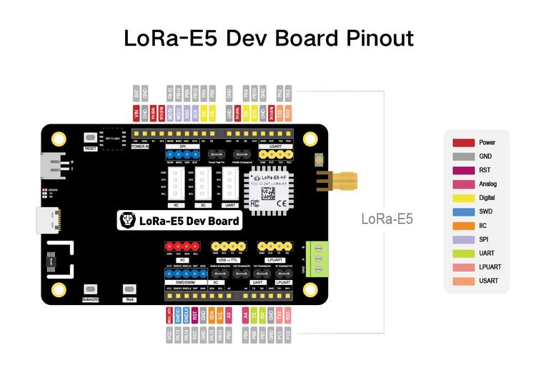

.. zephyr:board:: lora_e5_dev_board

Overview
********

The LoRa-E5 Dev Board is a compact board for the evaluation of the
Seeed Studio LoRa-E5 STM32WLE5JC module.
The LoRa-E5-HF STM32WLE5JC Module supports multiple LPWAN protocols on the
868/915MHz frequency bands with up to 20.8dBm output power at 3.3V.
All GPIOs of the LoRa-E5 Module are laid out supporting
various data protocols and interfaces including RS-485 and Grove.

Hardware
********

The boards LoRa-E5 Module packages a STM32WLE5JC SOC, a 32MHz TCXO,
and a 32.768kHz crystal oscillator in a 28-pin SMD package.
This STM32WLEJC SOC is powered by ARM Cortex-M4 core and integrates Semtech
SX126X LoRa IP to support (G)FSK, BPSK, (G)MSK, and LoRa modulations.

- LoRa-E5 STM32WLE5JC Module with STM32WLE5JC multiprotocol LPWAN single-core
  32-bit microcontroller (Arm® Cortex®-M4 at 48 MHz) in 28-pin SMD package
  featuring:

  - Ultra-low-power MCU
  - RF transceiver (150 MHz to 960 MHz frequency range) supporting LoRa®,
    (G)FSK, (G)MSK, and BPSK modulations
  - 256-Kbyte Flash memory and 64-Kbyte SRAM
  - Hardware encryption AES256-bit and a True random number generator

- 1 user LED
- 1 user, 1 boot, and 1 reset push-button
- 32.768 kHz LSE crystal oscillator
- 32 MHz HSE oscillator
- 1 LM75A Temperature Sensor
- 1 SPI-Flash Bonding Pad(not populated)
- Board connectors:

  - USB Type-C connector
  - JST2.0 Battery connector (3-5V)
  - 3 Grove connectors(2x IIC and 1x UART)
  - RS-485 connector
  - SMA-K and IPEX antenna connectors

- Delivered with SMA antenna (per default IPEX connector is disconnected)
- Flexible power-supply options: USB Type C, JST2.0, 2x AA 3V Battery Holder, or
  external sources via header.
- Switchable 3.3V and 5V power rails.
- Comprehensive free software libraries and examples available with the
  STM32CubeWL MCU Package
- Support of a wide choice of Integrated Development Environments (IDEs)
  including IAR Embedded Workbench®, MDK-ARM, and STM32CubeIDE
- Suitable for rapid prototyping of end nodes based on LoRaWAN, Sigfox, wM-Bus,
  and many other proprietary protocols

More information about the board can be found at the `LoRa-E5 Dev Board Wiki`_.

More information about LoRa-E5 STM32WLE5JC Module can be found here:

- `LoRa-E5 STM32WLE5JC Module Wiki`_
- `LoRa-E5 STM32WLE5JC Module datasheet`_
- `STM32WLE5JC datasheet`_
- `STM32WLE5JC reference manual`_
- `STM32WLE5JC on www.st.com`_

Supported Features
==================

.. zephyr:board-supported-hw::

Connections and IOs
===================

LoRa-E5 Dev Board has 4 GPIO controllers. These controllers are responsible
for pin muxing, input/output, pull-up, etc.

Available pins:
---------------

Default Zephyr Peripheral Mapping:
----------------------------------

.. rst-class:: rst-columns

- LPUART_1 TX : PC1
- LPUART_1 RX : PC0
- USART_1 TX  : PB6
- USART_1 RX  : PB7
- USART_2 TX  : PA2
- USART_2 RX  : PA3
- I2C_2_SCL   : PB15
- I2C_2_SDA   : PA15
- SPI_2_NSS   : PB9
- SPI_2_SCK   : PB13
- SPI_2_MISO  : PB14
- SPI_2_MOSI  : PA10
- BOOT_PB     : PB13
- USER_PB     : PA0
- LED_1       : PB5
- ADC1 IN2    : PB3

Default Zephyr Peripheral to Connector Mapping:
-----------------------------------------------

.. rst-class:: rst-columns

- RS-485: USART_2
- grove_serial: USART_1
- grove_i2c: I2C_2

Power Rails
-----------

The board has multiple power rails, which are always turned on in the default
configuration.

+---------+-------------------+-------------------+
| Name    | Derived from      | Controlled by     |
+=========+===================+===================+
| MAIN    | battery, USB, ... | Always on         |
+---------+-------------------+-------------------+
| VCC     | MAIN              | Always on         |
+---------+-------------------+-------------------+
| 5V      | MAIN              | SOC pin PB10      |
+---------+-------------------+-------------------+
| 3V3     | VCC               | SOC pin PA9       |
+---------+-------------------+-------------------+

A list of the devices and their power rails:

+--------------------+---------+
| Device             | Rail    |
+====================+=========+
| STM32WLE5JC        | VCC     |
+--------------------+---------+
| RS-485 Transceiver | 3V3     |
+--------------------+---------+

System Clock
------------

LoRa-E5 Development board System Clock could be driven by the low-power
internal(MSI), High-speed internal(HSI) or High-speed external(HSE) oscillator,
as well as main PLL clock.
By default System clock is driven by the MSI clock at 48MHz.

Programming and Debugging
*************************

Applications for the ``lora_e5_dev_board`` board configuration can be built the
usual way (see :ref:`build_an_application`).

In the factory the module is flashed with an DFU bootloader, an AT command
firmware, and the read protection level 1 is enabled.
So before you can program a zephyr application to the module for the first time
you have to reset the read protection to level 0.
In case you use an st-link debugger you can use the STM32CubeProgrammer GUI to
set the RDP option byte to ``AA``,
or use the STM32_Programmer_CLI passing the ``--readunprotect`` command
to perform this read protection regression.
The RDP level 1 to RDP level 0 regression will erase the factory programmed AT
firmware, from which seeed studio has neither released the source code nor a binary.
Also, note that on the module the ``BOOT0`` pin of the SOC is not accessible,
so the system bootloader will only be executed if configured in the option bytes.

Flashing
========

The LoRa-E5 Dev Board does not include a on-board debug probe.
But the module can be debugged by connecting an external debug probe to the
blue 2.54mm header labeled ``SWIM/SWD``.
Depending on the external probe used, ``openocd``, the ``stm32cubeprogrammer``,
``pyocd``, ``blackmagic``, or ``jlink`` runner can be used to flash the board.
Additional notes:

- Pyocd: For STM32WL support Pyocd needs additional target information, which
  can be installed by adding "pack" support with the following pyocd command:

.. code-block:: console

   $ pyocd pack --update
   $ pyocd pack --install stm32wl

Flashing an application to LoRa-E5 Dev board
--------------------------------------------

Connect the LoRa-E5 to your host computer using the external debug probe.
Then build and flash an application. Here is an example for the
:zephyr:code-sample:`hello_world` application.

Run a serial host program to connect with your board:
Per default the console on ``usart1`` is available on the USB Type C connector
via the built-in USB to UART converter.

.. code-block:: console

   $ picocom --baud 115200 /dev/ttyACM0

Then build and flash the application.

.. zephyr-app-commands::
   :zephyr-app: samples/hello_world
   :board: lora_e5_dev_board
   :goals: build flash

Debugging
=========

You can debug an application in the usual way.  Here is an example for the
:zephyr:code-sample:`blinky` application.

.. zephyr-app-commands::
   :zephyr-app: samples/basic/blinky
   :board: lora_e5_dev_board
   :maybe-skip-config:
   :goals: debug

.. _LoRa-E5 Dev Board Wiki:
   https://wiki.seeedstudio.com/LoRa_E5_Dev_Board/

.. _LoRa-E5 STM32WLE5JC Module Wiki:
   https://wiki.seeedstudio.com/LoRa-E5_STM32WLE5JC_Module/

.. _LoRa-E5 STM32WLE5JC Module datasheet:
    https://files.seeedstudio.com/products/317990687/res/LoRa-E5%20module%20datasheet_V1.0.pdf

.. _STM32WLE5JC on www.st.com:
   https://www.st.com/en/microcontrollers-microprocessors/stm32wle5jc.html

.. _STM32WLE5JC datasheet:
   https://www.st.com/resource/en/datasheet/stm32wle5jc.pdf

.. _STM32WLE5JC reference manual:
   https://www.st.com/resource/en/reference_manual/dm00530369-stm32wlex-advanced-armbased-32bit-mcus-with-subghz-radio-solution-stmicroelectronics.pdf
