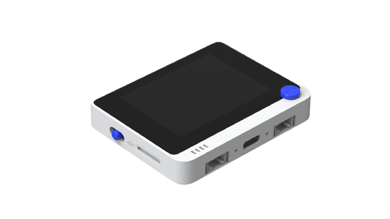

.. _wio_terminal:

Wio Terminal
############

Overview
********

The Wio Terminal is a small (72 mm x 57 mm x 12 mm) and powerful ARM board with
wireless connectivity (2.4G/5G dual-band Wi-Fi and BLE 5.0), LCD display,
USB C port, FPC connector, microSD card slot, Raspberry Pi compatible 40-pins
header and 2 Grove connectors.

Hardware
********

- ATSAMD51P19 ARM Cortex-M4F processor at 120 MHz
- 512 KiB flash memory and 192 KiB of RAM
- 4 MiB external flash
- MicroSD card slot
- RTL8720DN 2.4G/5G Dual Bands Wireless and BLE5.0 Combo Module
- 2.4inch LCD display
- LIS3DH accelerometer
- Microphone 1.0V-10V -42dB
- Speaker ≥78dB @10cm 4000Hz
- Light Sensor 400-1050nm
- Infrared Emitter 940nm
- GPIO 40 pin (Raspberry Pi compatible)
- 2x Grove connectors
- 1x user LED
- 3x user buttons
- 5-way user button
- Power/Reset/Boot mode switch
- Native USB port

Supported Features
==================

The wio_terminal board configuration supports the following hardware features:

.. list-table::
    :header-rows: 1

    * - Interface
      - Controller
      - Driver / Component
    * - NVIC
      - on-chip
      - Nested vector interrupt controller
    * - Flash
      - on-chip
      - Can be used with LittleFS to store files
    * - SYSTICK
      - on-chip
      - Systick
    * - WDT
      - on-chip
      - Watchdog
    * - GPIO
      - on-chip
      - I/O ports
    * - USART
      - on-chip
      - Serial port
    * - I2C
      - on-chip
      - Inter-Integrated Circuit
    * - SPI
      - on-chip
      - Serial Peripheral Interface port
    * - TRNG
      - on-chip
      - True Random Number Generator
    * - HWINFO
      - on-chip
      - Unique 128 bit serial number
    * - RTC
      - on-chip
      - Real-Time Counter
    * - USB
      - on-chip
      - USB device
    * - PWM
      - on-chip
      - PWM

Other hardware features are not currently supported by Zephyr.

The default configuration can be found in the Kconfig file
:zephyr_file:`boards/seeed_studio/wio_terminal/wio_terminal_defconfig`.

Zephyr can use the default Cortex-M SYSTICK timer or the SAM0 specific RTC.
To use the RTC, set :kconfig:option:`CONFIG_CORTEX_M_SYSTICK=n` and set
:kconfig:option:`CONFIG_SYS_CLOCK_TICKS_PER_SEC` to no more than 32 kHZ divided
by 7, i.e. no more than 4500.

Connections and IOs
===================

The `Wio Terminal Getting started guide`_ has detailed information about the
board including `pinouts`_ and its `schematics`_.

System Clock
============

The SAMD51 MCU is configured to use the 32.768 kHz internal oscillator with the
on-chip PLL generating the 120 MHz system clock.

Serial Port
===========

Zephyr console output is available using the USB connector, which is used to
make the console available on PC as USB CDC class.

USB Device Port
===============

The SAMD51 MCU has a USB device port that can be used to communicate with a
host PC.  See the :ref:`usb-samples` sample applications for more, such as the
:zephyr:code-sample:`usb-cdc-acm` sample which sets up a virtual serial port that echos
characters back to the host PC.

Programming and Debugging
*************************

The Wio Terminal ships with an UF2 bootloader that is BOSSA compatible. The
bootloader can be entered by quickly tapping the reset button twice.

The UF2 file is generated when building the application, and it is possible to
use it to flash the target. Enter the bootloader by quickly sliding the power
button twice, and copy the UF2 file to the USB mass storage device. The device
reboots on the new firmware after the UF2 file has finished transferring.

Flashing
========

#. Build the Zephyr kernel and the :code:`button` sample application:

   .. zephyr-app-commands::
      :zephyr-app: samples/basic/button
      :board: wio_terminal
      :goals: build
      :compact:

#. Swipe the reset/power button down twice quickly to enter bootloader mode

#. Flash the image:

   .. zephyr-app-commands::
      :zephyr-app: samples/basic/button
      :board: wio_terminal
      :goals: flash
      :compact:

   You should see the blue (user) LED flashing whenever you press the third
   (counting from the top left) user button at the top of the Wio Terminal.

Debugging
=========

In addition to the built-in bootloader, the Wio Terminal can be flashed and
debugged using an SWD probe such as the Segger J-Link.

#.  Solder cables to the :code:`SWCLK`, :code:`SWDIO`, :code:`RESET`,
    :code:`GND`, and :code:`3V3` pins. See `Test with SWD`_ for more
    information.

#. Connect the board to the probe by connecting the :code:`SWCLK`,
   :code:`SWDIO`, :code:`RESET`, :code:`GND`, and :code:`3V3` pins on the
   Wio Terminal to the :code:`SWCLK`, :code:`SWDIO`, :code:`RESET`,
   :code:`GND`, and :code:`VTref` pins on the `J-Link`_.

#. Flash the image:

   .. zephyr-app-commands::
      :zephyr-app: samples/basic/button
      :board: wio_terminal
      :goals: flash
      :flash-args: -r openocd
      :compact:

#. Start debugging:

   .. zephyr-app-commands::
      :zephyr-app: samples/basic/button
      :board: wio_terminal
      :goals: debug
      :compact:

References
**********

.. target-notes::

.. _Wio Terminal Getting started guide:
   https://wiki.seeedstudio.com/Wio-Terminal-Getting-Started/

.. _pinouts:
    https://wiki.seeedstudio.com/Wio-Terminal-Getting-Started/#pinout-diagram

.. _schematics:
    https://wiki.seeedstudio.com/Wio-Terminal-Getting-Started/#resources

.. _Test with SWD:
    https://wiki.seeedstudio.com/Wio-Terminal-Getting-Started/#test-with-swd

.. _J-Link:
    https://www.segger.com/products/debug-probes/j-link/technology/interface-description/
