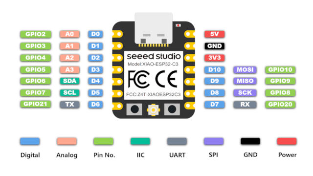

.. zephyr:board:: xiao_esp32c3

Overview
********

Seeed Studio XIAO ESP32-C3 is an IoT mini development board based on the
Espressif ESP32-C3 WiFi/Bluetooth dual-mode chip.

For more details see the `Seeed Studio XIAO ESP32C3`_ wiki page.

Hardware
********

This board is based on the ESP32-C3 with 4MB of flash, WiFi and BLE support. It
has an USB-C port for programming and debugging, integrated battery charging
and an U.FL external antenna connector. It is based on a standard XIAO 14 pin
pinout.

.. include:: ../../../espressif/common/soc-esp32c3-features.rst
   :start-after: espressif-soc-esp32c3-features

Supported Features
==================

.. zephyr:board-supported-hw::

Connections and IOs
===================

The board uses a standard XIAO pinout, the default pin mapping is the following:

   XIAO ESP32C3 Pinout

System Requirements
*******************

.. include:: ../../../espressif/common/system-requirements.rst
   :start-after: espressif-system-requirements

Programming and Debugging
*************************

.. zephyr:board-supported-runners::

.. include:: ../../../espressif/common/building-flashing.rst
   :start-after: espressif-building-flashing

.. include:: ../../../espressif/common/board-variants.rst
   :start-after: espressif-board-variants

Debugging
=========

.. include:: ../../../espressif/common/openocd-debugging.rst
   :start-after: espressif-openocd-debugging

References
**********

.. target-notes::

.. _`Seeed Studio XIAO ESP32C3`: https://wiki.seeedstudio.com/XIAO_ESP32C3_Getting_Started
