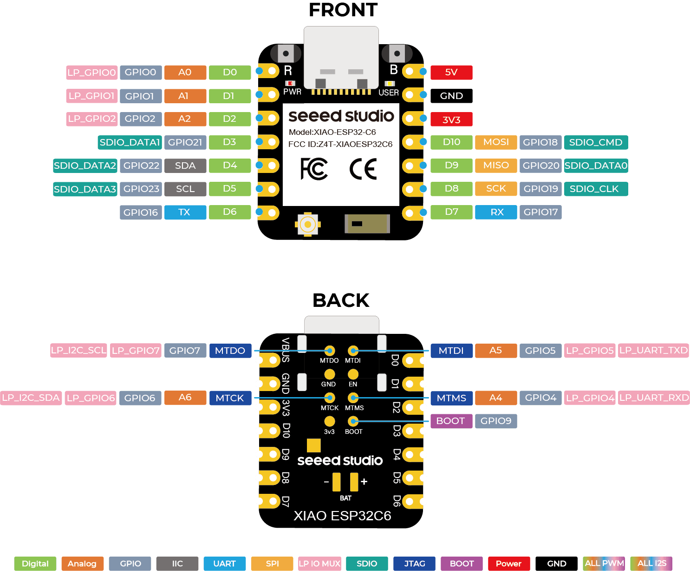

.. zephyr:board:: xiao_esp32c6

Overview
********

Seeed Studio XIAO ESP32C6 is powered by the highly-integrated ESP32-C6 SoC.
It consists of a high-performance (HP) 32-bit RISC-V processor, which can be clocked up to 160 MHz,
and a low-power (LP) 32-bit RISC-V processor, which can be clocked up to 20 MHz.
It has a 320KB ROM, a 512KB SRAM, and works with external flash.
This board integrates complete Wi-Fi, Bluetooth LE, Zigbee, and Thread functions.
For more information, check `Seeed Studio XIAO ESP32C6`_ .

Hardware
********

This board is based on the ESP32-C6 with 4MB of flash, integrating 2.4 GHz Wi-Fi 6,
Bluetooth 5.3 (LE) and the 802.15.4 protocol. It has an USB-C port for programming
and debugging, integrated battery charging and an U.FL external antenna connector.
It is based on a standard XIAO 14 pin pinout.

Supported Features
==================

.. zephyr:board-supported-hw::

The board uses a standard XIAO pinout, the default pin mapping is the following:

   XIAO ESP32C6 Pinout

System requirements
*******************

Prerequisites
=============

Espressif HAL requires WiFi and Bluetooth binary blobs in order work. Run the command
below to retrieve those files.

.. code-block:: console

   west blobs fetch hal_espressif

.. note::

   It is recommended running the command above after :file:`west update`.

Building & Flashing
*******************

Simple boot
===========

The board could be loaded using the single binary image, without 2nd stage bootloader.
It is the default option when building the application without additional configuration.

.. note::

   Simple boot does not provide any security features nor OTA updates.

MCUboot bootloader
==================

User may choose to use MCUboot bootloader instead. In that case the bootloader
must be built (and flashed) at least once.

There are two options to be used when building an application:

1. Sysbuild
2. Manual build

.. note::

   User can select the MCUboot bootloader by adding the following line
   to the board default configuration file.

   .. code:: cfg

      CONFIG_BOOTLOADER_MCUBOOT=y

Sysbuild
========

The sysbuild makes possible to build and flash all necessary images needed to
bootstrap the board with the EPS32 SoC.

To build the sample application using sysbuild use the command:

.. zephyr-app-commands::
   :tool: west
   :zephyr-app: samples/hello_world
   :board: xiao_esp32c6
   :goals: build
   :west-args: --sysbuild
   :compact:

By default, the ESP32 sysbuild creates bootloader (MCUboot) and application
images. But it can be configured to create other kind of images.

Build directory structure created by sysbuild is different from traditional
Zephyr build. Output is structured by the domain subdirectories:

.. code-block::

  build/
  ├── hello_world
  │   └── zephyr
  │       ├── zephyr.elf
  │       └── zephyr.bin
  ├── mcuboot
  │    └── zephyr
  │       ├── zephyr.elf
  │       └── zephyr.bin
  └── domains.yaml

.. note::

   With ``--sysbuild`` option the bootloader will be re-build and re-flash
   every time the pristine build is used.

For more information about the system build please read the :ref:`sysbuild` documentation.

Manual build
============

During the development cycle, it is intended to build & flash as quickly possible.
For that reason, images can be built one at a time using traditional build.

The instructions following are relevant for both manual build and sysbuild.
The only difference is the structure of the build directory.

.. note::

   Remember that bootloader (MCUboot) needs to be flash at least once.

Build and flash applications as usual (see :ref:`build_an_application` and
:ref:`application_run` for more details).

.. zephyr-app-commands::
   :zephyr-app: samples/hello_world
   :board: xiao_esp32c6
   :goals: build

The usual ``flash`` target will work with the ``xiao_esp32c6`` board
configuration. Here is an example for the :zephyr:code-sample:`hello_world`
application.

.. zephyr-app-commands::
   :zephyr-app: samples/hello_world
   :board: xiao_esp32c6
   :goals: flash

Since the Zephyr console is by default on the ``usb_serial`` device, we use
the espressif monitor to view.

.. code-block:: console

   $ west espressif monitor

After the board has automatically reset and booted, you should see the following
message in the monitor:

.. code-block:: console

   ***** Booting Zephyr OS vx.x.x-xxx-gxxxxxxxxxxxx *****
   Hello World! xiao_esp32c6/esp32c6

Debugging
*********

As with much custom hardware, the ESP32-C6 modules require patches to
OpenOCD that are not upstreamed yet. Espressif maintains their own fork of
the project. The custom OpenOCD can be obtained at `OpenOCD ESP32`_.

The Zephyr SDK uses a bundled version of OpenOCD by default. You can overwrite that behavior by adding the
``-DOPENOCD=<path/to/bin/openocd> -DOPENOCD_DEFAULT_PATH=<path/to/openocd/share/openocd/scripts>``
parameter when building.

Here is an example for building the :zephyr:code-sample:`hello_world` application.

.. zephyr-app-commands::
   :zephyr-app: samples/hello_world
   :board: xiao_esp32c6
   :goals: build flash
   :gen-args: -DOPENOCD=<path/to/bin/openocd> -DOPENOCD_DEFAULT_PATH=<path/to/openocd/share/openocd/scripts>

You can debug an application in the usual way. Here is an example for the :zephyr:code-sample:`hello_world` application.

.. zephyr-app-commands::
   :zephyr-app: samples/hello_world
   :board: xiao_esp32c6
   :goals: debug

References
**********

.. target-notes::

.. _`Seeed Studio XIAO ESP32C6`: https://wiki.seeedstudio.com/xiao_esp32c6_getting_started/
.. _`ESP32-C6 Datasheet`: https://www.espressif.com/sites/default/files/documentation/esp32-c6_datasheet_en.pdf
.. _`ESP32-C6 Technical Reference Manual`: https://espressif.com/sites/default/files/documentation/esp32-c6_technical_reference_manual_en.pdf
.. _`OpenOCD ESP32`: https://github.com/espressif/openocd-esp32/releases
