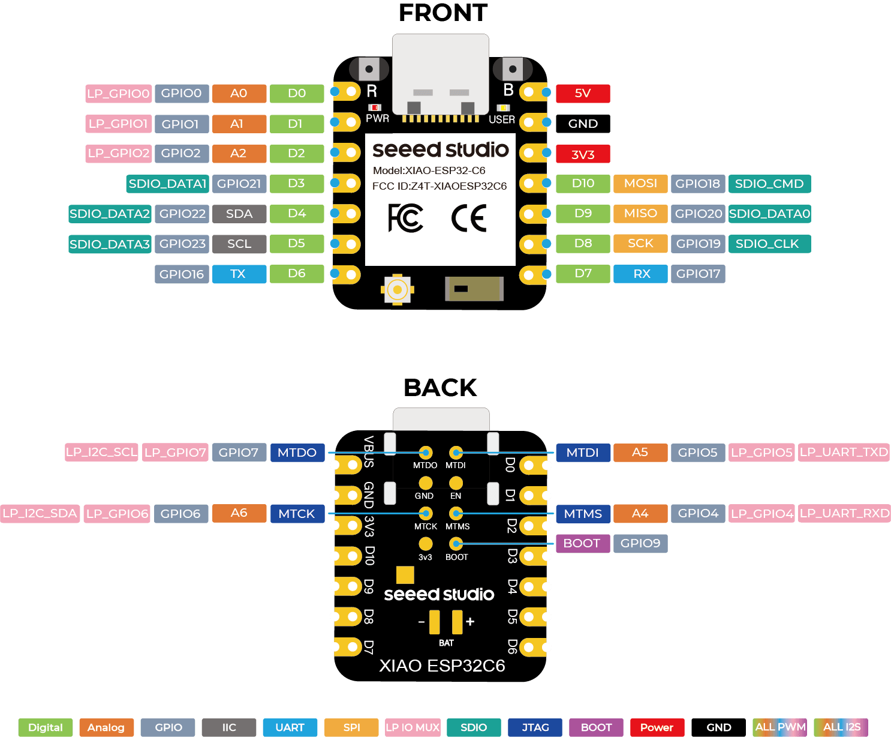

.. zephyr:board:: xiao_esp32c6

Overview
********

Seeed Studio XIAO ESP32C6 is powered by the highly-integrated ESP32-C6 SoC.
It consists of a high-performance (HP) 32-bit RISC-V processor, which can be clocked up to 160 MHz,
and a low-power (LP) 32-bit RISC-V processor, which can be clocked up to 20 MHz.
It has a 320KB ROM, a 512KB SRAM, and works with external flash.
This board integrates complete Wi-Fi, Bluetooth LE, Zigbee, and Thread functions.
For more information, check `Seeed Studio XIAO ESP32C6`_ .

Hardware
********

This board is based on the ESP32-C6 with 4MB of flash, integrating 2.4 GHz Wi-Fi 6,
Bluetooth 5.3 (LE) and the 802.15.4 protocol. It has an USB-C port for programming
and debugging, integrated battery charging and an U.FL external antenna connector.
It is based on a standard XIAO 14 pin pinout.

Supported Features
==================

.. zephyr:board-supported-hw::

The board uses a standard XIAO pinout, the default pin mapping is the following:

   XIAO ESP32C6 Pinout

System requirements
*******************

Espressif HAL requires WiFi and Bluetooth binary blobs in order work. Run the command
below to retrieve those files.

.. code-block:: console

   west blobs fetch hal_espressif

.. note::

   It is recommended running the command above after :file:`west update`.

Programming and Debugging
*************************

.. zephyr:board-supported-runners::

.. include:: ../../../espressif/common/building-flashing.rst
   :start-after: espressif-building-flashing

.. include:: ../../../espressif/common/board-variants.rst
   :start-after: espressif-board-variants

Debugging
=========

.. include:: ../../../espressif/common/openocd-debugging.rst
   :start-after: espressif-openocd-debugging

References
**********

.. target-notes::

.. _`Seeed Studio XIAO ESP32C6`: https://wiki.seeedstudio.com/xiao_esp32c6_getting_started/
.. _`ESP32-C6 Datasheet`: https://www.espressif.com/sites/default/files/documentation/esp32-c6_datasheet_en.pdf
.. _`ESP32-C6 Technical Reference Manual`: https://espressif.com/sites/default/files/documentation/esp32-c6_technical_reference_manual_en.pdf
.. _`OpenOCD ESP32`: https://github.com/espressif/openocd-esp32/releases
