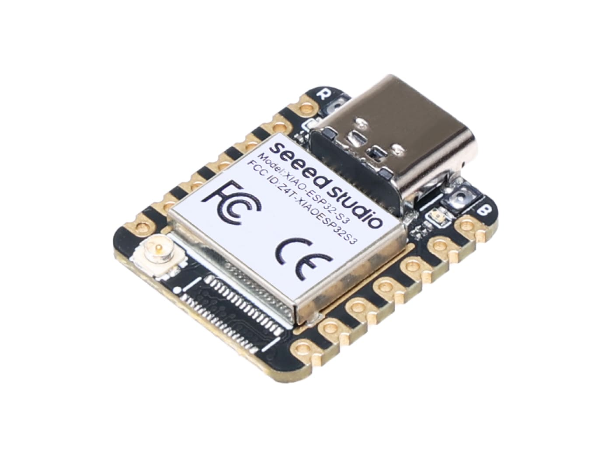

.. _xiao_esp32s3:

XIAO ESP32S3
############

Overview
********

Seeed Studio XIAO ESP32S3 is an IoT mini development board based on the
Espressif ESP32-S3 WiFi/Bluetooth dual-mode chip.

For more details see the `Seeed Studio XIAO ESP32S3`_ wiki page.

   XIAO ESP32S3

Hardware
********

This board is based on the ESP32-S3 with 8MB of flash, WiFi and BLE support. It
has an USB-C port for programming and debugging, integrated battery charging
and an U.FL external antenna connector. It is based on a standard XIAO 14 pin
pinout.

ESP32-S3 is a low-power MCU-based system on a chip (SoC) with integrated 2.4 GHz Wi-Fi
and Bluetooth® Low Energy (Bluetooth LE). It consists of high-performance dual-core microprocessor
(Xtensa® 32-bit LX7), a low power coprocessor, a Wi-Fi baseband, a Bluetooth LE baseband,
RF module, and numerous peripherals.

Supported Features
==================

Current Zephyr's XIAO ESP32S3 board supports the following features:

+------------+------------+-------------------------------------+
| Interface  | Controller | Driver/Component                    |
+============+============+=====================================+
| UART       | on-chip    | serial port                         |
+------------+------------+-------------------------------------+
| GPIO       | on-chip    | gpio                                |
+------------+------------+-------------------------------------+
| PINMUX     | on-chip    | pinmux                              |
+------------+------------+-------------------------------------+
| USB-JTAG   | on-chip    | hardware interface                  |
+------------+------------+-------------------------------------+
| SPI Master | on-chip    | spi                                 |
+------------+------------+-------------------------------------+
| TWAI/CAN   | on-chip    | can                                 |
+------------+------------+-------------------------------------+
| ADC        | on-chip    | adc                                 |
+------------+------------+-------------------------------------+
| Timers     | on-chip    | counter                             |
+------------+------------+-------------------------------------+
| Watchdog   | on-chip    | watchdog                            |
+------------+------------+-------------------------------------+
| TRNG       | on-chip    | entropy                             |
+------------+------------+-------------------------------------+
| LEDC       | on-chip    | pwm                                 |
+------------+------------+-------------------------------------+
| MCPWM      | on-chip    | pwm                                 |
+------------+------------+-------------------------------------+
| PCNT       | on-chip    | qdec                                |
+------------+------------+-------------------------------------+
| GDMA       | on-chip    | dma                                 |
+------------+------------+-------------------------------------+

Connections and IOs
===================

The board uses a standard XIAO pinout, the default pin mapping is the following:

.. figure:: img/xiao_esp32s3_pinout.jpg
   :align: center
   :alt: XIAO ESP32S3 Pinout

   XIAO ESP32S3 Pinout

Prerequisites
-------------

Espressif HAL requires WiFi and Bluetooth binary blobs in order work. Run the command
below to retrieve those files.

.. code-block:: console

   west blobs fetch hal_espressif

.. note::

   It is recommended running the command above after :file:`west update`.

Building & Flashing
*******************

Simple boot
===========

The board could be loaded using the single binary image, without 2nd stage bootloader.
It is the default option when building the application without additional configuration.

.. note::

   Simple boot does not provide any security features nor OTA updates.

MCUboot bootloader
==================

User may choose to use MCUboot bootloader instead. In that case the bootloader
must be built (and flashed) at least once.

There are two options to be used when building an application:

1. Sysbuild
2. Manual build

.. note::

   User can select the MCUboot bootloader by adding the following line
   to the board default configuration file.

   .. code:: cfg

      CONFIG_BOOTLOADER_MCUBOOT=y

Sysbuild
========

The sysbuild makes possible to build and flash all necessary images needed to
bootstrap the board with the ESP32 SoC.

To build the sample application using sysbuild use the command:

.. zephyr-app-commands::
   :tool: west
   :zephyr-app: samples/hello_world
   :board: xiao_esp32s3
   :goals: build
   :west-args: --sysbuild
   :compact:

By default, the ESP32 sysbuild creates bootloader (MCUboot) and application
images. But it can be configured to create other kind of images.

Build directory structure created by sysbuild is different from traditional
Zephyr build. Output is structured by the domain subdirectories:

.. code-block::

  build/
  ├── hello_world
  │   └── zephyr
  │       ├── zephyr.elf
  │       └── zephyr.bin
  ├── mcuboot
  │    └── zephyr
  │       ├── zephyr.elf
  │       └── zephyr.bin
  └── domains.yaml

.. note::

   With ``--sysbuild`` option the bootloader will be re-build and re-flash
   every time the pristine build is used.

For more information about the system build please read the :ref:`sysbuild` documentation.

Manual build
============

During the development cycle, it is intended to build & flash as quickly possible.
For that reason, images can be built one at a time using traditional build.

The instructions following are relevant for both manual build and sysbuild.
The only difference is the structure of the build directory.

.. note::

   Remember that bootloader (MCUboot) needs to be flash at least once.

Build and flash applications as usual (see :ref:`build_an_application` and
:ref:`application_run` for more details).

.. zephyr-app-commands::
   :zephyr-app: samples/hello_world
   :board: xiao_esp32s3/esp32s3/procpu
   :goals: build

The usual ``flash`` target will work with the ``xiao_esp32s3`` board
configuration. Here is an example for the :ref:`hello_world`
application.

.. zephyr-app-commands::
   :zephyr-app: samples/hello_world
   :board: xiao_esp32s3/esp32s3/procpu
   :goals: flash

Open the serial monitor using the following command:

.. code-block:: shell

   west espressif monitor

After the board has automatically reset and booted, you should see the following
message in the monitor:

.. code-block:: console

   ***** Booting Zephyr OS vx.x.x-xxx-gxxxxxxxxxxxx *****
   Hello World! xiao_esp32s3

Debugging
*********

ESP32-S3 support on OpenOCD is available at `OpenOCD ESP32`_.

ESP32-S3 has a built-in JTAG circuitry and can be debugged without any additional chip. Only an USB cable connected to the D+/D- pins is necessary.

Further documentation can be obtained from the SoC vendor in `JTAG debugging for ESP32-S3`_.

Here is an example for building the :ref:`hello_world` application.

.. zephyr-app-commands::
   :zephyr-app: samples/hello_world
   :board: xiao_esp32s3/esp32/procpu
   :goals: build flash

You can debug an application in the usual way. Here is an example for the :ref:`hello_world` application.

.. zephyr-app-commands::
   :zephyr-app: samples/hello_world
   :board: xiao_esp32s3/esp32/procpu
   :goals: debug

References
**********

.. _`Seeed Studio XIAO ESP32S3`: https://wiki.seeedstudio.com/xiao_esp32s3_getting_started/
.. _`JTAG debugging for ESP32-S3`: https://docs.espressif.com/projects/esp-idf/en/latest/esp32s3/api-guides/jtag-debugging/
.. _`OpenOCD ESP32`: https://github.com/espressif/openocd-esp32/releases
