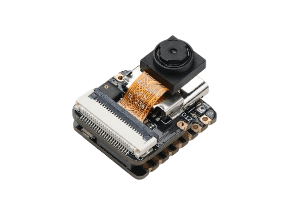

.. zephyr:board:: xiao_esp32s3

Overview
********

Seeed Studio XIAO ESP32S3 and XIAO ESP32S3 Sense are IoT mini development boards based on the
Espressif ESP32-S3 WiFi/Bluetooth dual-mode chip.

For more details see the `Seeed Studio XIAO ESP32S3`_ wiki page.

.. figure:: img/xiao_esp32s3.jpg
   :align: center
   :alt: XIAO ESP32S3

   XIAO ESP32S3

   XIAO ESP32S3 Sense

Hardware
********

This board is based on the ESP32-S3 with 8MB of flash, WiFi and BLE support. It
has an USB-C port for programming and debugging, integrated battery charging
and an U.FL external antenna connector. It is based on a standard XIAO 14 pin
pinout.

ESP32-S3 is a low-power MCU-based system on a chip (SoC) with integrated 2.4 GHz Wi-Fi
and Bluetooth® Low Energy (Bluetooth LE). It consists of high-performance dual-core microprocessor
(Xtensa® 32-bit LX7), a low power coprocessor, a Wi-Fi baseband, a Bluetooth LE baseband,
RF module, and numerous peripherals.

Additionally, Sense variant integrates a OV2640 camera sensor, microphone and sdcard slot.

.. include:: ../../../espressif/common/soc-esp32s3-features.rst
   :start-after: espressif-soc-esp32s3-features

Supported Features
==================

.. zephyr:board-supported-hw::

Connections and IOs
===================

The board uses a standard XIAO pinout, the default pin mapping is the following:

.. figure:: img/xiao_esp32s3_pinout.jpg
   :align: center
   :alt: XIAO ESP32S3 Pinout

   XIAO ESP32S3 and XIAO ESP32S3 Sense Pinout

System Requirements
*******************

.. include:: ../../../espressif/common/system-requirements.rst
   :start-after: espressif-system-requirements

Programming and Debugging
*************************

.. zephyr:board-supported-runners::

.. include:: ../../../espressif/common/building-flashing.rst
   :start-after: espressif-building-flashing

.. include:: ../../../espressif/common/board-variants.rst
   :start-after: espressif-board-variants

Debugging
=========

.. include:: ../../../espressif/common/openocd-debugging.rst
   :start-after: espressif-openocd-debugging

Sample applications
*******************

.. tabs::

   .. group-tab:: XIAO ESP32S3

      .. zephyr-app-commands::
         :zephyr-app: samples/hello_world
         :board: xiao_esp32s3/esp32s3/procpu
         :goals: debug

   .. group-tab:: XIAO ESP32S3 Sense

      .. zephyr-app-commands::
         :zephyr-app: samples/hello_world
         :board: xiao_esp32s3/esp32s3/procpu/sense
         :goals: debug

You can debug an application in the usual way. Here is an example for the :zephyr:code-sample:`hello_world` application.

.. tabs::

   .. group-tab:: XIAO ESP32S3

      .. zephyr-app-commands::
         :zephyr-app: samples/hello_world
         :board: xiao_esp32s3/esp32s3/procpu
         :goals: debug

   .. group-tab:: XIAO ESP32S3 Sense

      .. zephyr-app-commands::
         :zephyr-app: samples/hello_world
         :board: xiao_esp32s3/esp32s3/procpu/sense
         :goals: debug

References
**********

.. target-notes::

.. _`Seeed Studio XIAO ESP32S3`: https://wiki.seeedstudio.com/xiao_esp32s3_getting_started/
