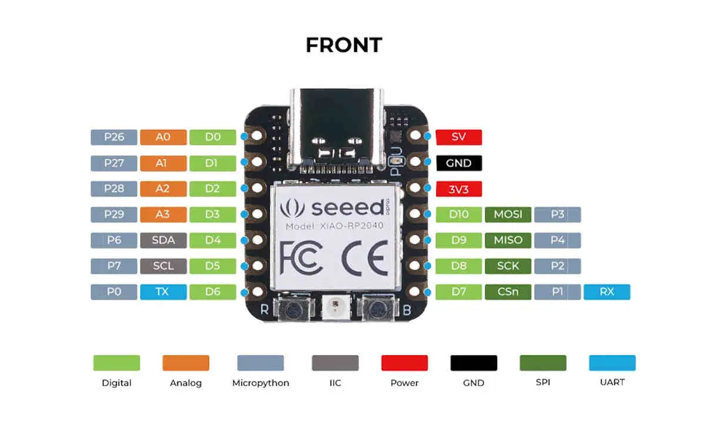

.. zephyr:board:: xiao_rp2040

Overview
********

The XIAO RP2040 is an IoT mini development board from Seeed Studio.
It is equipped with an RP2040 SoC, an on-board WS2812 addressable
LED, and USB connector. The USB bootloader allows it
to be flashed without any adapter, in a drag-and-drop manner.

For more details see the `Seeed Studio XIAO RP2040`_ wiki page.

Hardware
********

The Seeed Studio XIAO RP2040 is a low-power microcontroller that
carries the powerful Dual-core RP2040 processor with a flexible
clock running up to 133 MHz. There is also 264KB of SRAM, and 2MB of
on-board Flash memory.

There are 14 GPIO PINs on Seeed Studio XIAO RP2040, on which there
are 11 digital pins, 4 analog pins, 11 PWM Pins,1 I2C interface,
1 UART interface, 1 SPI interface, 1 SWD Bonding pad interface.

Supported Features
==================

The ``xiao_rp2040`` board target supports the following hardware
features:

.. list-table::
   :header-rows: 1

   * - Peripheral
     - Kconfig option
     - Devicetree compatible
   * - NVIC
     - N/A
     - :dtcompatible:`arm,v6m-nvic`
   * - UART
     - :kconfig:option:`CONFIG_SERIAL`
     - :dtcompatible:`raspberrypi,pico-uart`
   * - GPIO
     - :kconfig:option:`CONFIG_GPIO`
     - :dtcompatible:`raspberrypi,pico-gpio`
   * - ADC
     - :kconfig:option:`CONFIG_ADC`
     - :dtcompatible:`raspberrypi,pico-adc`
   * - I2C
     - :kconfig:option:`CONFIG_I2C`
     - :dtcompatible:`snps,designware-i2c`
   * - SPI
     - :kconfig:option:`CONFIG_SPI`
     - :dtcompatible:`raspberrypi,pico-spi`
   * - USB Device
     - :kconfig:option:`CONFIG_USB_DEVICE_STACK`
     - :dtcompatible:`raspberrypi,pico-usbd`
   * - HWINFO
     - :kconfig:option:`CONFIG_HWINFO`
     - N/A
   * - Watchdog Timer (WDT)
     - :kconfig:option:`CONFIG_WATCHDOG`
     - :dtcompatible:`raspberrypi,pico-watchdog`
   * - PWM
     - :kconfig:option:`CONFIG_PWM`
     - :dtcompatible:`raspberrypi,pico-pwm`
   * - Flash
     - :kconfig:option:`CONFIG_FLASH`
     - :dtcompatible:`raspberrypi,pico-flash-controller`
   * - Clock controller
     - :kconfig:option:`CONFIG_CLOCK_CONTROL`
     - :dtcompatible:`raspberrypi,pico-clock-controller`
   * - UART (PIO)
     - :kconfig:option:`CONFIG_SERIAL`
     - :dtcompatible:`raspberrypi,pico-uart-pio`

Pin Mapping
===========

The peripherals of the RP2040 SoC can be routed to various pins on the board.
The configuration of these routes can be modified through DTS. Please refer to
the datasheet to see the possible routings for each peripheral.

Default Zephyr Peripheral Mapping:
----------------------------------

.. rst-class:: rst-columns

- UART0_TX : P0
- UART0_RX : P1
- I2C1_SDA : P6
- I2C1_SCL : P7
- SPI0_RX : P4
- SPI0_SCK : P2
- SPI0_TX : P3

Connections and IOs
===================

The board uses a standard XIAO pinout, the default pin mapping is the following:

   XIAO RP2040 Pinout

Programming and Debugging
*************************

Flashing
========

Using UF2
---------

You can flash the Xiao RP2040 with a UF2 file.
By default, building an app for this board will generate a
:file:`build/zephyr/zephyr.uf2` file. If the Xiao RP2040 is powered on with
the ``BOOTSEL`` button pressed, it will appear on the host as a mass storage
device. The UF2 file should be copied to the device, which will
flash the Xiao RP2040.

References
**********

.. target-notes::

.. _`Seeed Studio XIAO RP2040`: https://wiki.seeedstudio.com/XIAO-RP2040/
