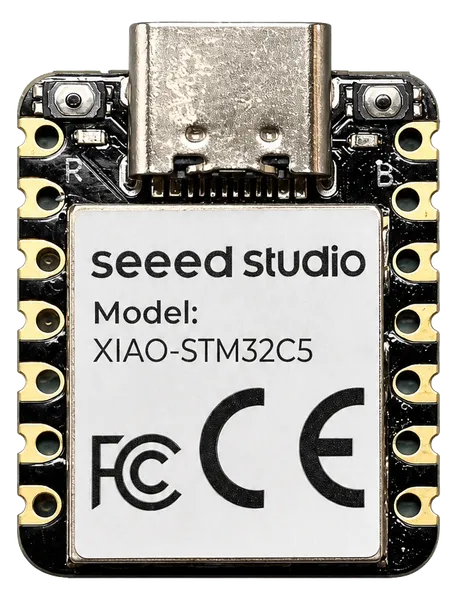

.. zephyr:board:: xiao_stm32c5

Overview
********

The Seeed Studio XIAO STM32C5 is a compact development board based on the
STM32C5A3CG SoC (Cortex-M33, 144 MHz, 256 KB SRAM, 1 MB flash). It offers the
standard XIAO form factor with a 16-pin castellated connector exposing UART,
I2C, SPI, ADC and two FDCAN buses, an on-board LSM6DSL IMU, a CAN transceiver,
a user LED, a BOOT button, battery charging with a voltage-divider enable, and
a USB-C connector for power, programming (TinyUF2 bootloader) and a CDC-ACM
virtual serial port.

For more details see the `Seeed Studio XIAO STM32C5`_ board documentation
and examples repository.

   Seeed Studio XIAO STM32C5

Hardware
********

The board is based on the STM32C5A3CG SoC in a UFQFPN48 package:

* ARM Cortex-M33 with FPU, up to 144 MHz
* 1 MB flash, 256 KB SRAM
* XSPI1 with an on-board 16 MB Puya PY25Q128HA NOR flash (external flash
  support will be enabled on top of the MSPI framework)
* USB 2.0 full-speed device/controller

Supported Features
==================

.. zephyr:board-supported-hw::

Connections and IOs
===================

The board uses the standard XIAO pinout. Default mapping of D0-D15 is as
follows:

.. rst-class:: rst-columns

* D0 : PA0 (ADC1_IN0)
* D1 : PA1 (ADC1_IN1)
* D2 : PA2 (ADC1_IN2)
* D3 : PA3 (ADC1_IN3)
* D4 : PB7 (I2C1_SDA)
* D5 : PB6 (I2C1_SCL)
* D6 : PA9 (USART1_TX)
* D7 : PA10 (USART1_RX)
* D8 : PE2 (SPI3_SCK)
* D9 : PB0 (SPI3_MISO)
* D10 : PB15 (SPI3_MOSI)
* D11 : PB8 (FDCAN1_RX)
* D12 : PB9 (FDCAN1_TX)
* D13 : PB5 (FDCAN2_RX)
* D14 : PB13 (FDCAN2_TX)
* D15 : PB14 (CAN transceiver standby)

On-board devices:

* User LED: PB12 (active low)
* BOOT button: PH2/BOOT0
* LSM6DSL IMU: I2C2 (0x6A), interrupt on PC13
* Battery voltage divider enable: PA15
* CAN transceiver standby: PB14

Programming and Debugging
*************************

.. zephyr:board-supported-runners::

Flashing
========

Using UF2
---------

The board ships with the TinyUF2 bootloader. Build an application with
``west build -b xiao_stm32c5`` and copy the generated
:file:`build/zephyr/zephyr.uf2` to the ``XIAOSTM32C5`` mass-storage device
that appears when the board is powered on with the BOOT button held (double
reset also enters the bootloader). The application is linked to start at
0x08008000 to coexist with the bootloader.

Using STM32CubeProgrammer
-------------------------

The board is configured to be flashed using west `STM32CubeProgrammer`_ runner,
so its :ref:`installation <stm32cubeprog-flash-host-tools>` is required. An
external SWD probe (ST-LINK, J-Link, ...) is needed; the SWD signals are
exposed on the XIAO header footprint.

Debugging
=========

Debugging with an external SWD probe (ST-LINK, J-Link, ...) is supported in
the usual way; the SWD signals are exposed on the XIAO header footprint.

Default configuration
=====================

The default console and shell use the USB CDC-ACM virtual serial port from
the common ``boards/common/usb`` fragments. Alternatively, USART1 is available
on the D6/D7 pins (PA9/PA10, 115200 8N1).

References
**********

.. target-notes::

.. _`Seeed Studio XIAO STM32C5`:
   https://github.com/Seeed-Studio/platform-seeedboards/tree/main/examples/seeed-xiao-stm32c5
.. _STM32CubeProgrammer:
   https://www.st.com/en/development-tools/stm32cubeprog.html
