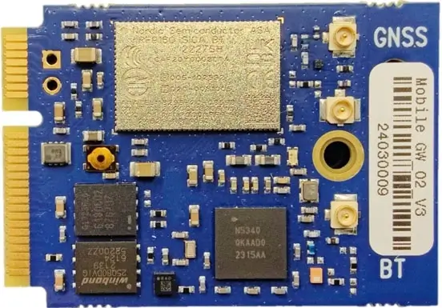
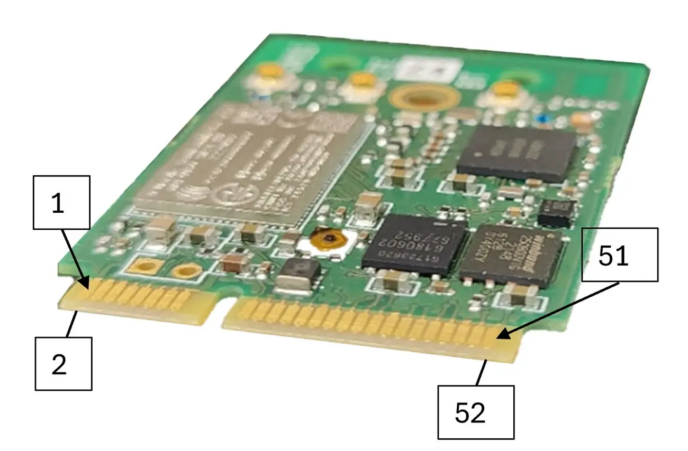
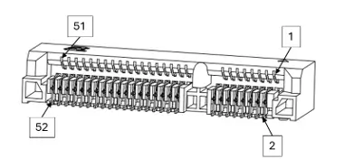

.. _sgw2:

SGW-2
#####

Overview
********
The Sensoan Gateway 2 (SGW-2) connectivity board is a multi-SoC board
equipped with an nrf9160 SoC for LTE-M and NB-IoT and an nrf5340 SoC
for Bluetooth LE connectivity. The two SoCs are connected to each other
via an MCU interface and they expose pins to the user via an edge connector,
which is compatible with e.g. the TE Connectivity 2041119-2 board edge
connector.

   SGW-2 (Credit: Sensoan Oy)

   SGW-2 pinout (Credit: Sensoan Oy)

   TE Connectivity 2041119-2 (Credit: Sensoan Oy)

The nrf9160 SoC provides support for the following devices:

* :abbr:`ADC (Analog to Digital Converter)`
* CLOCK
* FLASH
* :abbr:`GPIO (General Purpose Input Output)`
* :abbr:`I2C (Inter-Integrated Circuit)`
* :abbr:`MPU (Memory Protection Unit)`
* :abbr:`NVIC (Nested Vectored Interrupt Controller)`
* :abbr:`PWM (Pulse Width Modulation)`
* :abbr:`RTC (nRF RTC System Clock)`
* Segger RTT (RTT Console)
* :abbr:`SPI (Serial Peripheral Interface)`
* :abbr:`UARTE (Universal asynchronous receiver-transmitter with EasyDMA)`
* :abbr:`WDT (Watchdog Timer)`
* :abbr:`IDAU (Implementation Defined Attribution Unit)`

nRF5340 SoC provides support for the following devices:

* :abbr:`ADC (Analog to Digital Converter)`
* CLOCK
* FLASH
* :abbr:`GPIO (General Purpose Input Output)`
* :abbr:`IDAU (Implementation Defined Attribution Unit)`
* :abbr:`I2C (Inter-Integrated Circuit)`
* :abbr:`MPU (Memory Protection Unit)`
* :abbr:`NVIC (Nested Vectored Interrupt Controller)`
* :abbr:`PWM (Pulse Width Modulation)`
* RADIO (Bluetooth Low Energy and 802.15.4)
* :abbr:`RTC (nRF RTC System Clock)`
* Segger RTT (RTT Console)
* :abbr:`SPI (Serial Peripheral Interface)`
* :abbr:`UARTE (Universal asynchronous receiver-transmitter)`
* :abbr:`USB (Universal Serial Bus)`
* :abbr:`WDT (Watchdog Timer)`

Hardware
********
In addition to the nrf9160 and nrf5340 SoCs, the board incorporates
a LIS2DH accelerometer (connected over I2C) and a W25Q80DV external flash
(connected over SPI). These can be configured for either SoC (but not for
both simultaneously). By default they have been configured for the nRF9160.

Supported Features
==================
The ``sgw2/nrf9160`` and ``sgw2/nrf9160/ns`` board targets support the
following hardware features:

+-----------+------------+----------------------+
| Interface | Controller | Driver/Component     |
+===========+============+======================+
| ADC       | on-chip    | adc                  |
+-----------+------------+----------------------+
| CLOCK     | on-chip    | clock_control        |
+-----------+------------+----------------------+
| FLASH     | on-chip    | flash                |
+-----------+------------+----------------------+
| GPIO      | on-chip    | gpio                 |
+-----------+------------+----------------------+
| I2C(M)    | on-chip    | i2c                  |
+-----------+------------+----------------------+
| MPU       | on-chip    | arch/arm             |
+-----------+------------+----------------------+
| NVIC      | on-chip    | arch/arm             |
+-----------+------------+----------------------+
| PWM       | on-chip    | pwm                  |
+-----------+------------+----------------------+
| RTC       | on-chip    | system clock         |
+-----------+------------+----------------------+
| RTT       | Segger     | console              |
+-----------+------------+----------------------+
| SPI(M/S)  | on-chip    | spi                  |
+-----------+------------+----------------------+
| SPU       | on-chip    | system protection    |
+-----------+------------+----------------------+
| UARTE     | on-chip    | serial               |
+-----------+------------+----------------------+
| WDT       | on-chip    | watchdog             |
+-----------+------------+----------------------+

The ``sgw2/nrf5340/cpuapp`` and ``sgw2/nrf5340/cpuapp/ns`` board targets
support the following hardware features:

+-----------+------------+----------------------+
| Interface | Controller | Driver/Component     |
+===========+============+======================+
| ADC       | on-chip    | adc                  |
+-----------+------------+----------------------+
| CLOCK     | on-chip    | clock_control        |
+-----------+------------+----------------------+
| FLASH     | on-chip    | flash                |
+-----------+------------+----------------------+
| GPIO      | on-chip    | gpio                 |
+-----------+------------+----------------------+
| I2C(M)    | on-chip    | i2c                  |
+-----------+------------+----------------------+
| MPU       | on-chip    | arch/arm             |
+-----------+------------+----------------------+
| NVIC      | on-chip    | arch/arm             |
+-----------+------------+----------------------+
| PWM       | on-chip    | pwm                  |
+-----------+------------+----------------------+
| RTC       | on-chip    | system clock         |
+-----------+------------+----------------------+
| RTT       | Segger     | console              |
+-----------+------------+----------------------+
| SPI(M/S)  | on-chip    | spi                  |
+-----------+------------+----------------------+
| SPU       | on-chip    | system protection    |
+-----------+------------+----------------------+
| UARTE     | on-chip    | serial               |
+-----------+------------+----------------------+
| USB       | on-chip    | usb                  |
+-----------+------------+----------------------+
| WDT       | on-chip    | watchdog             |
+-----------+------------+----------------------+

The ``sgw2/nrf5340/cpunet`` board target supports the following
hardware features:

+-----------+------------+----------------------+
| Interface | Controller | Driver/Component     |
+===========+============+======================+
| CLOCK     | on-chip    | clock_control        |
+-----------+------------+----------------------+
| FLASH     | on-chip    | flash                |
+-----------+------------+----------------------+
| GPIO      | on-chip    | gpio                 |
+-----------+------------+----------------------+
| I2C(M)    | on-chip    | i2c                  |
+-----------+------------+----------------------+
| MPU       | on-chip    | arch/arm             |
+-----------+------------+----------------------+
| NVIC      | on-chip    | arch/arm             |
+-----------+------------+----------------------+
| RADIO     | on-chip    | Bluetooth,           |
|           |            | ieee802154           |
+-----------+------------+----------------------+
| RTC       | on-chip    | system clock         |
+-----------+------------+----------------------+
| RTT       | Segger     | console              |
+-----------+------------+----------------------+
| SPI(M/S)  | on-chip    | spi                  |
+-----------+------------+----------------------+
| UARTE     | on-chip    | serial               |
+-----------+------------+----------------------+
| WDT       | on-chip    | watchdog             |
+-----------+------------+----------------------+

Connections and IOs
===================
The two SoCs are connected by a 7-pin MCU interface. These correspond to
certain GPIO ports and pins on each SoC, and in devicetree overlay files
these can be referred to by macros MCU_IF_PORT_X and MCU_IF_PIN_X for
X ranging from 0 to 6 (see also the macros in board.h) or by the GPIO nexus
node mcu_if.

+------------+-------------+-------------+
| MCU IF pin | nrf9160 pin | nrf5340 pin |
+============+=============+=============+
| 0          | P0.02       | P0.13       |
+------------+-------------+-------------+
| 1          | P0.01       | P0.16       |
+------------+-------------+-------------+
| 2          | P0.00       | P0.19       |
+------------+-------------+-------------+
| 3          | P0.31       | P0.21       |
+------------+-------------+-------------+
| 4          | P0.30       | P1.04       |
+------------+-------------+-------------+
| 5          | P0.29       | P1.06       |
+------------+-------------+-------------+
| 6          | P0.28       | P1.08       |
+------------+-------------+-------------+

Other connections between SoCs include a connection from nrf9160 to the
reset pin of nrf5340 and connections from nrf5340 to COEX pins of nrf9160.

+-------------+-------------+
| nrf9160 pin | nrf5340 pin |
+=============+=============+
| P0.26       | !RESET      |
+-------------+-------------+
| COEX0       | P0.31       |
+-------------+-------------+
| COEX1       | P1.14       |
+-------------+-------------+
| COEX2       | P1.15       |
+-------------+-------------+

Pins reserved for the LIS2DH and W25Q80DV common to both SoCs are as follows.

+------------+-------------+-------------+
| LIS2DH     | nrf9160 pin | nrf5340 pin |
+============+=============+=============+
| INT1       | P0.06       | P0.23       |
+------------+-------------+-------------+
| INT2       |             | P1.05       |
+------------+-------------+-------------+

+------------+-------------+-------------+-----------+
| W25Q80DV   | nrf9160 pin | nrf5340 pin | Other     |
+============+=============+=============+===========+
| SPI_SCK    | P0.03       | P0.26       |           |
+------------+-------------+-------------+-----------+
| SPI_MOSI   | P0.04       | P0.27       |           |
+------------+-------------+-------------+-----------+
| SPI_MISO   | P0.05       | P0.28       |           |
+------------+-------------+-------------+-----------+
| !CS        | P0.07       | P0.25       |           |
+------------+-------------+-------------+-----------+
| !HOLD      |             |             | VDD_3V3   |
+------------+-------------+-------------+-----------+
| !WP        |             |             | VDD_3V3   |
+------------+-------------+-------------+-----------+

External pins are available by a 52-pin edge connector. Also some of these
correspond to certain GPIO ports and pins on each SoC, and in devicetree
overlay files these can be referred to by macros EDGE_CONN_PORT_X and
EDGE_CONN_PIN_X for different values of X (see also the macros in board.h)
or by the GPIO nexus node edge_connector. The roles of these external pins
are detailed below.

Info text indicates that the IO should be used for the specified purpose,
the lack of an info text indicates an IO that can be freely configured.
Pins 7-9 correspond to onboard RGB leds and pin 11 corresponds to an onboard
button (a copper colored circle in the middle near the side containing the
edge connector), and the external pins can be used e.g. for connecting
external LEDs and buttons having the same roles as the onboard ones.

+------------+---------------+------------------------------------------------+-------------+-------------+
| Edge pin   | Name          | Info                                           | nrf9160 pin | nrf5340 pin |
+============+===============+================================================+=============+=============+
| 1          | VDDH          | 3.3V-5.5V input to SGW                         |             |             |
+------------+---------------+------------------------------------------------+-------------+-------------+
| 2          | GND           | Ground                                         |             |             |
+------------+---------------+------------------------------------------------+-------------+-------------+
| 3          | VDDH          | 3.3V-5.5V input to SGW                         |             |             |
+------------+---------------+------------------------------------------------+-------------+-------------+
| 4          | GND           | Ground                                         |             |             |
+------------+---------------+------------------------------------------------+-------------+-------------+
| 5          | VDDH          | 3.3V-5.5V input to SGW                         |             |             |
+------------+---------------+------------------------------------------------+-------------+-------------+
| 6          | GND           | Ground                                         |             |             |
+------------+---------------+------------------------------------------------+-------------+-------------+
| 7          | LED_Red       | Parallel to SGW LED, active current 2mA        | P0.08       |             |
+------------+---------------+------------------------------------------------+-------------+-------------+
| 8          | LED_Green     | Parallel to SGW LED, active current 2mA        | P0.09       |             |
+------------+---------------+------------------------------------------------+-------------+-------------+
| 9          | LED_Blue      | Parallel to SGW LED, active current 2mA        | P0.10       |             |
+------------+---------------+------------------------------------------------+-------------+-------------+
| 10         | GND           | Ground                                         |             |             |
+------------+---------------+------------------------------------------------+-------------+-------------+
| 11         | BUTTON        | Parallel to SGW button                         | P0.13       |             |
+------------+---------------+------------------------------------------------+-------------+-------------+
| 12         | GND           | Ground                                         |             |             |
+------------+---------------+------------------------------------------------+-------------+-------------+
| 13         | VDD_3V3       | 3.3V output from SGW                           |             |             |
+------------+---------------+------------------------------------------------+-------------+-------------+
| 14         | GND           | Ground                                         |             |             |
+------------+---------------+------------------------------------------------+-------------+-------------+
| 15         | VDD_3V3       | 3.3V output from SGW                           |             |             |
+------------+---------------+------------------------------------------------+-------------+-------------+
| 16         | GND           | Ground                                         |             |             |
+------------+---------------+------------------------------------------------+-------------+-------------+
| 17         | GPIO          |                                                | P0.14       |             |
+------------+---------------+------------------------------------------------+-------------+-------------+
| 18         | GPIO          |                                                | P0.16       |             |
+------------+---------------+------------------------------------------------+-------------+-------------+
| 19         | GPIO          |                                                | P0.15       |             |
+------------+---------------+------------------------------------------------+-------------+-------------+
| 20         | GPIO          |                                                | P0.18       |             |
+------------+---------------+------------------------------------------------+-------------+-------------+
| 21         | GPIO          |                                                | P0.17       |             |
+------------+---------------+------------------------------------------------+-------------+-------------+
| 22         | GPIO          |                                                | P0.20       |             |
+------------+---------------+------------------------------------------------+-------------+-------------+
| 23         | GPIO          |                                                | P0.19       |             |
+------------+---------------+------------------------------------------------+-------------+-------------+
| 24         | GPIO          |                                                |             | P0.07       |
+------------+---------------+------------------------------------------------+-------------+-------------+
| 25         | GPIO          |                                                |             | P0.06       |
+------------+---------------+------------------------------------------------+-------------+-------------+
| 26         | GPIO          |                                                |             | P0.05       |
+------------+---------------+------------------------------------------------+-------------+-------------+
| 27         | GND           | Ground                                         |             |             |
+------------+---------------+------------------------------------------------+-------------+-------------+
| 28         | VBUS          | USB 5V                                         |             | VBUS        |
+------------+---------------+------------------------------------------------+-------------+-------------+
| 29         | GPIO          |                                                |             | P0.04       |
+------------+---------------+------------------------------------------------+-------------+-------------+
| 30         | USB_DN        | USB_DN                                         |             | D-          |
+------------+---------------+------------------------------------------------+-------------+-------------+
| 31         | I2C_SDA       | I2C_SDA                                        | P0.27       | P1.03       |
+------------+---------------+------------------------------------------------+-------------+-------------+
| 32         | USB_DP        | USB_DP                                         |             | D+          |
+------------+---------------+------------------------------------------------+-------------+-------------+
| 33         | I2C_SCL       | I2C_SCL                                        | P0.11       | P1.02       |
+------------+---------------+------------------------------------------------+-------------+-------------+
| 34         | A_SWDIO       | nrf9160 (Primary chip)                         | SWDIO       |             |
+------------+---------------+------------------------------------------------+-------------+-------------+
| 35         | A_SWDCLK      | nrf9160 (Primary chip)                         | SWDCLK      |             |
+------------+---------------+------------------------------------------------+-------------+-------------+
| 36         | A_RESET       | nrf9160 (Primary chip)                         | !RESET      |             |
+------------+---------------+------------------------------------------------+-------------+-------------+
| 37         | GND           | Ground                                         |             |             |
+------------+---------------+------------------------------------------------+-------------+-------------+
| 38         | GPIO          |                                                | P0.25       |             |
+------------+---------------+------------------------------------------------+-------------+-------------+
| 39         | GPIO          |                                                | P0.24       |             |
+------------+---------------+------------------------------------------------+-------------+-------------+
| 40         | GPIO          |                                                | P0.23       |             |
+------------+---------------+------------------------------------------------+-------------+-------------+
| 41         | GPIO          |                                                | P0.22       |             |
+------------+---------------+------------------------------------------------+-------------+-------------+
| 42         | GPIO          |                                                | P0.21       |             |
+------------+---------------+------------------------------------------------+-------------+-------------+
| 43         | B_SWDIO       | nrf5340 (Secondary chip)                       |             | SWDIO       |
+------------+---------------+------------------------------------------------+-------------+-------------+
| 44         | B_RESET       | nrf5340 (Secondary chip)                       |             | !RESET      |
+------------+---------------+------------------------------------------------+-------------+-------------+
| 45         | B_SWDCLK      | nrf5340 (Secondary chip)                       |             | SWDCLK      |
+------------+---------------+------------------------------------------------+-------------+-------------+
| 46         | GND           | Ground                                         |             |             |
+------------+---------------+------------------------------------------------+-------------+-------------+
| 47         | GND           | Ground                                         |             |             |
+------------+---------------+------------------------------------------------+-------------+-------------+
| 48         | GPIO          |                                                | P0.12       |             |
+------------+---------------+------------------------------------------------+-------------+-------------+
| 49         | GPIO          |                                                |             | P0.09       |
+------------+---------------+------------------------------------------------+-------------+-------------+
| 50         | GPIO          |                                                |             | P0.10       |
+------------+---------------+------------------------------------------------+-------------+-------------+
| 51         | GPIO          |                                                |             | P0.11       |
+------------+---------------+------------------------------------------------+-------------+-------------+
| 52         | GPIO          |                                                |             | P0.12       |
+------------+---------------+------------------------------------------------+-------------+-------------+

Using GNSS and LTE require connecting external GNSS and LTE antennas into
U.FL connectors labeled by GNSS and LTE (the label LTE is covered by a sticker
in the figure, but this is the middle connector). An external BT antenna cannot
be used without a hardware modification.

Programming and Debugging
*************************

Flashing
========
The nrf9160 and nrf5340 SoCs are flashed via edge connector pins 34-36
and 43-45 respectively. These correspond to the SWDIO, SWDCLK and RESET
pins of each SoC (see the table above).

Logs are by default transmitted via UART whose TX and RX are connected
respectively to edge connector pins 22 and 23 in the case of nrf9160,
to pins 24 and 25 in the case of nrf5340/cpuapp and to pins 26 and 29
in the case of nrf5340/cpunet.
