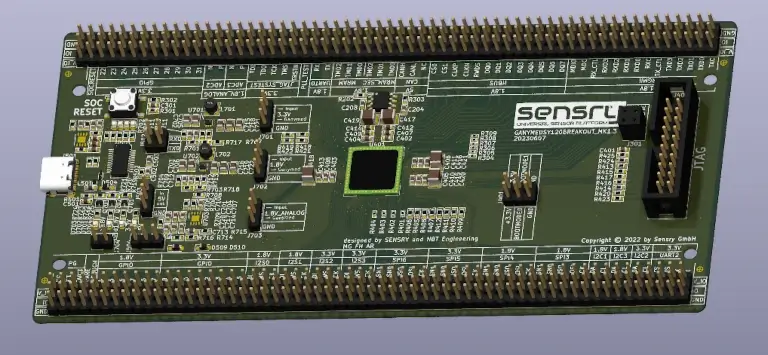
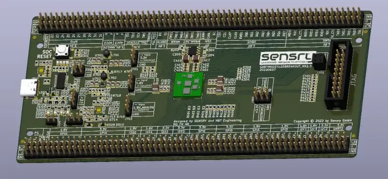

.. _ganymed_bob:

Ganymed Break-Out-Board (BOB)
#############################

Overview
********

.. note::

   All software for the Ganymed Break-Out-Board (BOB) is experimental and hardware availability
   is restricted to the participants in the limited sampling program.

The Ganymed board hardware provides support for the Ganymed sy1xx series IoT multicore
RISC-V SoC with optional sensor level.

The SoC has the following core features:

* 32-Bit RISC-V 1+8-core processor, up to 500MHz

  * 1x Data Acquisition Unit
  * 8x Data Processing Unit
  * Event Bus
  * MicroDMA

* 4096 KB Global SRAM
* 64 KB Secure SRAM
* 512 KB Global MRAM
* 512 KB Secure MRAM
* CLOCK
* :abbr:`32x GPIO (General Purpose Input Output)`
* :abbr:`4x TWIM (I2C-compatible two-wire interface with MicroDMA)`
* 4x I2S
* :abbr:`7x SPI (Serial Peripheral Interface with MicroDMA)`
* :abbr:`3x UART (Universal receiver-transmitter with MicroDMA)`
* :abbr:`1x TSN (Time sensitive networking ethernet MAC with MicroDMA)`
* 1x CAN-FD
* 3x ADC

     Ganymed Break-Out-Board (BOB) equipped with SY120 GBM (Credit: Sensry)

     Ganymed Break-Out-Board (BOB) equipped with SY120 GEN1 (Credit: Sensry)

Hardware
********

The Ganymed BOB has:

* Assembly options for the SoC include

  * SY120-GBM - Generic Base Module without top level sensors
  * SY120-GEN1 - Generic Module type 1 with top level sensors (Bosch BME680 - SPI1 , Bosch BMA456 - SPI0, Bosch BMG250 - SPI2, STMicro MIS2DH - I2C0)

* power section for on-board power generation and power measurement (selectable)
* 40-pin JTAG connector (compatible to Olimex ARM-JTAG-OCD-H)
* USB over FTDI (connected to UART0)
* Header for I/Os and additional configuration

Supported Features
==================

The ``ganymed-bob/sy120-gbm`` board supports the following hardware features:

+-----------+------------+----------------------+
| Interface | Controller | Driver/Component     |
+===========+============+======================+
| CLOCK     | on-chip    | clock_control        |
+-----------+------------+----------------------+
| GPIO      | on-chip    | gpio                 |
+-----------+------------+----------------------+
| TWIM      | on-chip    | i2c                  |
+-----------+------------+----------------------+
| SPI(M)    | on-chip    | spi                  |
+-----------+------------+----------------------+
| UART      | on-chip    | serial               |
+-----------+------------+----------------------+
| TSN       | on-chip    | ethernet MAC         |
+-----------+------------+----------------------+
| MDIO      | on-chip    |                      |
+-----------+------------+----------------------+
| TIMER     | on-chip    |                      |
+-----------+------------+----------------------+
| PINCTRL   | on-chip    |                      |
+-----------+------------+----------------------+
| I2S       | on-chip    | coming soon          |
+-----------+------------+----------------------+
| CAN       | on-chip    | CAN - coming soon    |
+-----------+------------+----------------------+
| SPU       | on-chip    | system protection    |
+-----------+------------+----------------------+
| GRTC      | on-chip    | counter              |
+-----------+------------+----------------------+
| PWM       | on-chip    | pwm                  |
+-----------+------------+----------------------+
| MRAM      | on-chip    | non-volatile memory  |
+-----------+------------+----------------------+
| SAADC     | on-chip    | adc - coming soon    |
+-----------+------------+----------------------+

Other hardware features have not been enabled yet for this board.

The ``ganymed-bob/sy120-gen1`` board includes all hardware features of the ``ganymed-bob/sy120-gbm`` board and comes additionally
with these features:

+-----------+------------+----------------------+
| Interface | Controller | Driver/Component     |
+===========+============+======================+
| BME680    | on-chip    | environment sensor   |
+-----------+------------+----------------------+
| BMA456    | on-chip    | acceleration sensor  |
+-----------+------------+----------------------+
| BMG250    | on-chip    | gyrosope sensor      |
+-----------+------------+----------------------+
| MIS2DH    | on-chip    | vibration sensor     |
+-----------+------------+----------------------+

Other hardware features have not been enabled yet for this board.

For more detailed description please refer to `Ganymed BreakOut Board Documentation`_

Power
*****

* USB type-C
* external 5V power source

Programming and Debugging
*************************

Applications for the ``ganymed_bob/sy120_gbm`` board can be
built and flashed in the usual way. See
:ref:`build_an_application` and :ref:`application_run` for more details on
building and running.

Building the :zephyr:code-sample:`hello_world` sample:

.. code-block:: console

    west build -b ganymed_bob/sy120_gbm samples/hello_world

Testing the Ganymed BreakOut Board
**********************************

Test the Ganymed with a :zephyr:code-sample:`hello_world` sample.

Flash the zephyr image:

.. code-block:: console

    west flash --serial /dev/ttyUSB0

Then attach a serial console, ex. minicom / picocom / putty; Reset the target.
The sample output should be:

.. code-block:: console

    Hello World! ganymed_bob/sy120_gbm

References
**********

.. target-notes::

.. _`Ganymed BreakOut Board Documentation`: https://docs.sensry.net/datasheets/sy120-bob/
