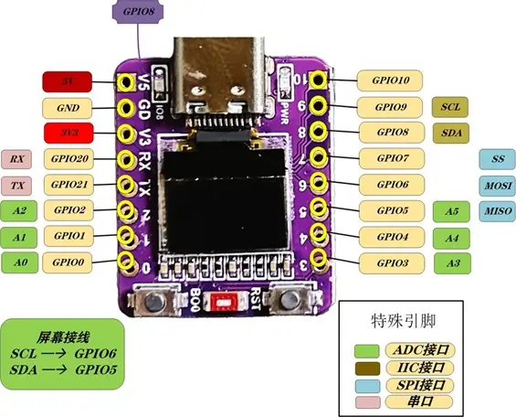

.. _abrobot_esp32c3oled_shield:

Abrobot ESP32 C3 OLED Shield
############################

Overview
********

Abrobot esp32c3 oled only works with sh1106_compatible display driver. It does not support 1306 display driver commands.
Its screen resolution is 72x40.
Its screen start position is 30, 12.

Requirements
************

This shield can only be used with esp32c3_042_oled board.

Programming
***********

Set ``-b esp32c3_042_oled --shield abrobot_sh1106_72x40`` when you invoke ``west build``. For example:

.. zephyr-app-commands::
   :zephyr-app: samples/drivers/display
   :board: esp32c3_042_oled
   :shield: abrobot_sh1106_72x40
   :goals: build
