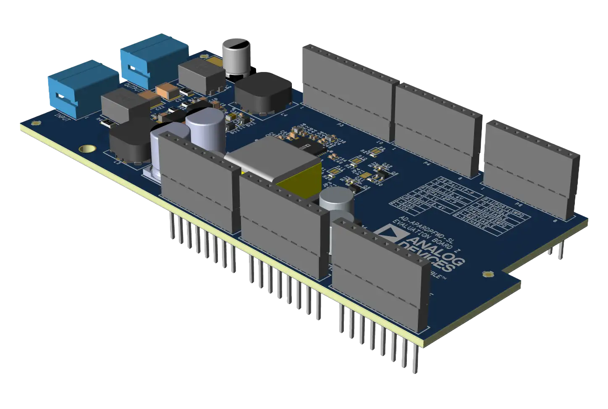

.. _ad_apardpfw_sl:

AD-APARDPFW-SL
##############

Overview
********

The AD-APARDPFW-SL is a 2-port 10BASE-T1L power forwarder with Single Pair Power over
Ethernet (SPoE) for development of field devices and applications on an
AD-APARD32690-SL platform board, featuring the Analog Devices ADIN2111 Ethernet switch.

Programming
***********

Set ``--shield ad_apardpfw_sl`` when you invoke ``west build``. For example:

.. zephyr-app-commands::
   :zephyr-app: samples/net/sockets/echo_server
   :board: apard32690/max32690/m4
   :shield: ad_apardpfw_sl
   :goals: build

Requirements
************

This shield is designed for use with the AD-APARD32690-SL platform board.

References
**********

- `AD-APARDPFW-SL product page`_
- `AD-APARDPFW-SL user guide`_
- `ADIN2111 product page`_
- `ADIN2111 data sheet`_

.. _AD-APARDPFW-SL product page:
   https://www.analog.com/en/resources/evaluation-hardware-and-software/evaluation-boards-kits/ad-apardpfw-sl.html

.. _AD-APARDPFW-SL user guide:
   https://analogdevicesinc.github.io/documentation/solutions/reference-designs/ad-apard32690-sl/ad-apardpfwd-sl/index.html

.. _ADIN2111 product page:
   https://www.analog.com/en/products/adin2111.html

.. _ADIN2111 data sheet:
   https://www.analog.com/media/en/technical-documentation/data-sheets/adin2111.pdf
