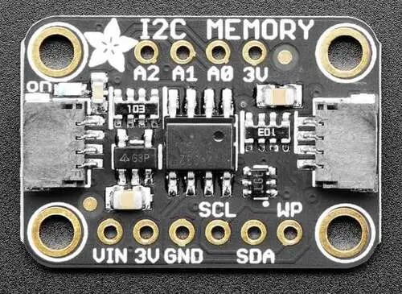

.. _adafruit_24lc32:

Adafruit 24LC32 EEPROM Shield
#############################

Overview
********

The `Adafruit 24LC32 EEPROM Shield`_ features a `Microchip 24LC32 EEPROM`_ (or
equivalent) and two STEMMA QT connectors.
It has a size of 32 kbit (4 kByte).

   Adafruit 24LC32 EEPROM Shield (Credit: Adafruit)

Requirements
************

This shield can be used with boards which provide an I2C connector, for
example STEMMA QT or Qwiic connectors.
The target board must define a ``zephyr_i2c`` node label.
See :ref:`shields` for more details.

Pin Assignments
===============

+--------------+------------------------------+
| Shield Pin   | Function                     |
+==============+==============================+
| SDA          | 24LC32 I2C SDA               |
+--------------+------------------------------+
| SCL          | 24LC32 I2C SCL               |
+--------------+------------------------------+
| WP           | 24LC32 write protection      |
+--------------+------------------------------+
| A0 - A2      | 24LC32 I2C address selection |
+--------------+------------------------------+

See :dtcompatible:`atmel,at24` for documentation on how to adjust the
devicetree file, for example to make the EEPROM read-only.

Programming
***********

Set ``--shield adafruit_24lc32`` when you invoke ``west build``. For example
when running the :zephyr:code-sample:`eeprom` sample:

.. zephyr-app-commands::
   :zephyr-app: samples/drivers/eeprom
   :board: adafruit_qt_py_rp2040
   :shield: adafruit_24lc32
   :goals: build

.. _Adafruit 24LC32 EEPROM Shield:
   https://learn.adafruit.com/adafruit-24lc32-i2c-eeprom-breakout-32kbit-4-kb

.. _Microchip 24LC32 EEPROM:
   https://www.microchip.com/en-us/product/24lc32
