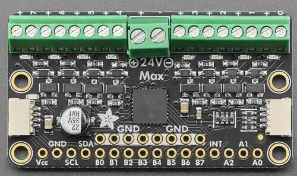

.. _adafruit_8chan_solenoid:

Adafruit I2C to 8 Channel Solenoid Driver Shield
################################################

Overview
********

The `Adafruit I2C to 8 Channel Solenoid Driver Shield`_ features
a `Microchip MCP23017 GPIO expander`_, eight MOSFETs and two STEMMA QT connectors.

   Adafruit 8 Channel Solenoid Driver Shield (Credit: Adafruit)

There are indication LEDs for each output channel. Note that the solenoid power supply
must be connected for these LEDs to work.

Requirements
************

This shield can be used with boards which provide an I2C connector, for example STEMMA QT
or Qwiic connectors. The target board must define a ``zephyr_i2c`` node label.
See :ref:`shields` for more details.

Pin Assignments
===============

+--------------+--------------------------------+
| Shield Pin   | Function                       |
+==============+================================+
| SDA          | MCP23017 I2C SDA               |
+--------------+--------------------------------+
| SCL          | MCP23017 I2C SCL               |
+--------------+--------------------------------+
| INT          | MCP23017 interrupt out         |
+--------------+--------------------------------+
| A0 - A2      | MCP23017 I2C address selection |
+--------------+--------------------------------+

The SDA and SCL signals are also available in the two STEMMA QT connectors.

In order to use interrupts you need to connect a separate wire from the shield to a GPIO pin
on your microcontroller board. See :dtcompatible:`microchip,mcp23017` for documentation on
how to adjust the devicetree overlay file.

By default are the I2C address selection pins pulled down to GND, resulting in a
7-bit I2C address of 0x20. Remember to modify the devicetree overlay file if you change
the address.

Programming
***********

Set ``--shield adafruit_8chan_solenoid`` when you invoke ``west build``. For example
when running the :zephyr:code-sample:`sensor_shell` sample:

.. zephyr-app-commands::
   :zephyr-app: samples/sensor/sensor_shell
   :board: adafruit_qt_py_rp2040
   :shield: adafruit_8chan_solenoid
   :gen-args: -DCONFIG_GPIO=y -DCONFIG_GPIO_SHELL=y -DCONFIG_I2C=y
   :goals: build

To configure and turn on solenoid 0 (label A0 on board backside):

.. code-block:: shell

   gpio conf mcp23017_adafruit_8chan_solenoid 0 o
   gpio set mcp23017_adafruit_8chan_solenoid 0 1

Turn off the solenoid:

.. code-block:: shell

   gpio set mcp23017_adafruit_8chan_solenoid 0 0

Use pin B0 as an output, and set it high:

.. code-block:: shell

   gpio conf mcp23017_adafruit_8chan_solenoid 8 o
   gpio set mcp23017_adafruit_8chan_solenoid 8 1

Set it low:

.. code-block:: shell

   gpio set mcp23017_adafruit_8chan_solenoid 8 0

Use pin B0 as an input with pullup:

.. code-block:: shell

   gpio conf mcp23017_adafruit_8chan_solenoid 8 iu
   gpio get mcp23017_adafruit_8chan_solenoid 8

.. _Adafruit I2C to 8 Channel Solenoid Driver Shield:
   https://learn.adafruit.com/adafruit-i2c-to-8-channel-solenoid-driver

.. _Microchip MCP23017 GPIO expander:
   https://www.microchip.com/en-us/product/mcp23017
