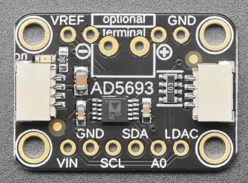

.. _adafruit_ad5693r:

Adafruit AD5693R DAC Shield
###########################

Overview
********

The `Adafruit AD5693R DAC Shield`_ features an `Analog Devices AD5693R 16-bit DAC`_ and
two STEMMA QT connectors. It has an output span of 2.5 Volt.

   Adafruit AD5693R DAC Shield (Credit: Adafruit)

Requirements
************

This shield can be used with boards which provide an I2C connector, for
example STEMMA QT or Qwiic connectors.
The target board must define a ``zephyr_i2c`` node label.
See :ref:`shields` for more details.

Pin Assignments
===============

+--------------+-------------------------------+
| Shield Pin   | Function                      |
+==============+===============================+
| SDA          | AD5693R I2C SDA               |
+--------------+-------------------------------+
| SCL          | AD5693R I2C SCL               |
+--------------+-------------------------------+
| A0           | AD5693R I2C address selection |
+--------------+-------------------------------+
| VREF         | AD5693R reference voltage out |
+--------------+-------------------------------+
| LDAC         | AD5693R Load DAC input        |
+--------------+-------------------------------+

When using this shield via the STEMMA QT connector, the supply voltage is 3.3 Volt, so the
maximum output voltage is 2.5 Volt.

The LDAC pin is pulled down on the shield, forcing an updated output voltage as soon as
the input register has been written.

See :dtcompatible:`adi,ad5693` for documentation on how to adjust the
devicetree file, for example to adjust the power-down mode.

Programming
***********

Set ``--shield adafruit_ad5693r`` when you invoke ``west build``. For example
when running the :zephyr:code-sample:`dac` sample:

.. zephyr-app-commands::
   :zephyr-app: samples/drivers/dac
   :board: adafruit_feather_rp2040
   :shield: adafruit_ad5693r
   :goals: build flash

Connect a voltmeter to the shield output and observe how the voltage changes.

.. _Adafruit AD5693R DAC Shield:
   https://learn.adafruit.com/adafruit-ad5693r-16-bit-dac-breakout-board

.. _Analog Devices AD5693R 16-bit DAC:
   https://www.analog.com/en/products/ad5693r.html
