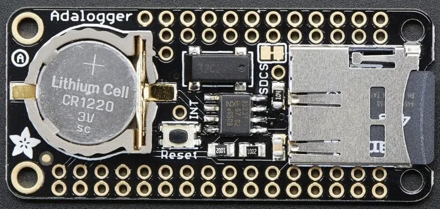

.. _adafruit_adalogger_featherwing_shield:

Adafruit Adalogger Featherwing Shield
#####################################

Overview
********

The `Adafruit Adalogger Featherwing Shield`_ features an `NXP PCF8523 Real-Time
Clock/Calendar with Battery Backup`_, and an SD card interface.

   Adafruit Adalogger Featherwing Shield (Credit: Adafruit)

Pin Assignments
===============

+-----------------------+---------------------------------------------+
| Shield Connector Pin  | Function                                    |
+=======================+=============================================+
| D10                   | SD card SPI CS                              |
+-----------------------+---------------------------------------------+
| MOSI                  | SD card SPI MOSI                            |
+-----------------------+---------------------------------------------+
| MISO                  | SD card SPI MISO                            |
+-----------------------+---------------------------------------------+
| SCK                   | SD card SPI SCK                             |
+-----------------------+---------------------------------------------+
| SDA                   | PCF8523 RTC I2C SDA                         |
+-----------------------+---------------------------------------------+
| SCL                   | PCF8523 RTC I2C SCL                         |
+-----------------------+---------------------------------------------+

Requirements
************

This shield can only be used with a board which provides a configuration for Feather connectors and
defines node aliases for SPI, I2C and GPIO interfaces (see :ref:`shields` for more details).

Programming
***********

Set ``--shield adafruit_adalogger_featherwing`` when you invoke ``west build``. For example:

.. zephyr-app-commands::
   :zephyr-app: tests/drivers/rtc/rtc_api
   :board: adafruit_feather_m0_basic_proto
   :shield: adafruit_adalogger_featherwing
   :goals: build

.. _Adafruit Adalogger Featherwing Shield:
   https://learn.adafruit.com/adafruit-adalogger-featherwing

.. _NXP PCF8523 Real-Time Clock/Calendar with Battery Backup:
   https://www.nxp.com/docs/en/data-sheet/PCF8523.pdf
