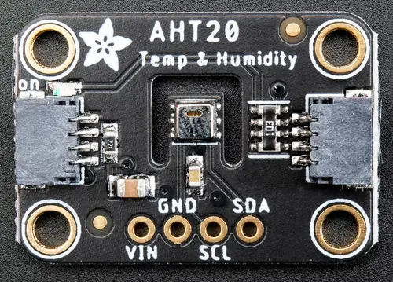

.. _adafruit_aht20:

Adafruit AHT20 Shield
#####################

Overview
********

The `Adafruit AHT20 Temperature and Humidity Sensor Shield`_ features
an `Aosong AHT20 Humidity and Temperature Sensor`_ and two STEMMA QT connectors.
It measures temperature and humidity.

   Adafruit AHT20 Shield (Credit: Adafruit)

Requirements
************

This shield can be used with boards which provide an I2C connector, for
example STEMMA QT or Qwiic connectors.
The target board must define a ``zephyr_i2c`` node label.
See :ref:`shields` for more details.

Pin Assignments
===============

+--------------+-------------------+
| Shield Pin   | Function          |
+==============+===================+
| SDA          | AHT20 I2C SDA     |
+--------------+-------------------+
| SCL          | AHT20 I2C SCL     |
+--------------+-------------------+

See :dtcompatible:`aosong,aht20` for details on possible devicetree settings.

Programming
***********

Set ``--shield adafruit_aht20`` when you invoke ``west build``. For example
when running the :zephyr:code-sample:`dht_polling` sample:

.. zephyr-app-commands::
   :zephyr-app: samples/sensor/dht_polling
   :board: adafruit_qt_py_rp2040
   :shield: adafruit_aht20
   :goals: build

.. _Adafruit AHT20 Temperature and Humidity Sensor Shield:
   https://learn.adafruit.com/adafruit-aht20

.. _Aosong AHT20 Humidity and Temperature Sensor:
   https://www.aosong.com/userfiles/files/media/Data%20Sheet%20AHT20.pdf
