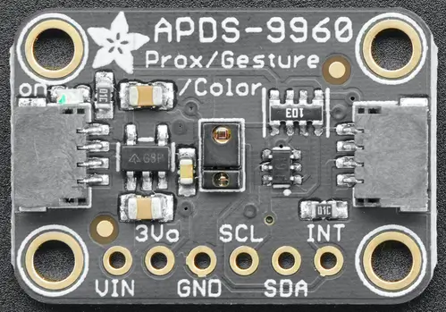

.. _adafruit_apds9960:

Adafruit APDS9960 Shield
########################

Overview
********

The `Adafruit APDS9960 Proximity, Light, RGB, and Gesture Sensor Shield`_ features
a `Broadcom APDS9960 sensor`_ and two STEMMA QT connectors.

   Adafruit APDS9960 Shield (Credit: Adafruit)

Requirements
************

This shield can be used with boards which provide an I2C connector, for
example STEMMA QT or Qwiic connectors.
The target board must define a ``zephyr_i2c`` node label.
See :ref:`shields` for more details.

Pin Assignments
===============

+--------------+------------------------+
| Shield Pin   | Function               |
+==============+========================+
| SDA          | APDS9960 I2C SDA       |
+--------------+------------------------+
| SCL          | APDS9960 I2C SCL       |
+--------------+------------------------+
| INT          | APDS9960 interrupt out |
+--------------+------------------------+

In order to use interrupts you need to connect a separate wire from the
shield to a GPIO pin on your microcontroller board. See
:dtcompatible:`avago,apds9960` for documentation on how to adjust the
devicetree file.

Programming
***********

Set ``--shield adafruit_apds9960`` when you invoke ``west build``. For example
when running the :zephyr:code-sample:`apds9960` proximity and light sample:

.. zephyr-app-commands::
   :zephyr-app: samples/sensor/apds9960
   :board: adafruit_qt_py_rp2040
   :shield: adafruit_apds9960
   :goals: build

.. _Adafruit APDS9960 Proximity, Light, RGB, and Gesture Sensor Shield:
   https://learn.adafruit.com/adafruit-apds9960-breakout

.. _Broadcom APDS9960 sensor:
   https://www.broadcom.com/products/optical-sensors/integrated-ambient-light-and-proximity-sensors/apds-9960
