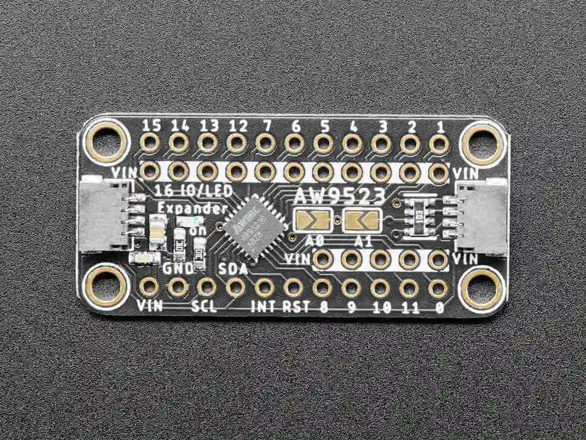

.. _adafruit_aw9523:

Adafruit AW9523 GPIO Expander and LED Driver
############################################

Overview
********

The `Adafruit AW9523 GPIO Expander and LED Driver`_ provides
16-channel GPIO/LED controller function.

   Adafruit AW9523 (Credit: Adafruit)

Pin Assignments
===============

+--------------------------+------------------------------------------+
| Shield Pin               | Function                                 |
+==========================+==========================================+
| SDA                      | AW9523B I2C SDA                          |
+--------------------------+------------------------------------------+
| SCL                      | AW9523B I2C SCL                          |
+--------------------------+------------------------------------------+
| INT (Pad on board)       | AW9523B Interrupt output [1]_            |
+--------------------------+------------------------------------------+
| RST (Pad on board)       | AW9523B Reset pin [2]_                   |
+--------------------------+------------------------------------------+

.. [1] To receive interrupts, connect the INT pin to the SoC's GPIO and set the connected
       GPIO in the ``int-gpios`` property in an additional overlay. The INT terminal must be
       pulled up.

.. [2] If you want to control the reset pin from the SoC, connect it to a GPIO on the SoC
       and define the ``reset-gpios`` property in an additional overlay.

Programming
***********

Set ``--shield adafruit_aw9523`` when you invoke ``west build``.

.. _Adafruit AW9523 GPIO Expander and LED Driver:
    https://learn.adafruit.com/adafruit-aw9523-gpio-expander-and-led-driver

.. _Awinic AW9523B 16 MULTI-FUNCTION LED DRIVER AND GPIO CONTROLLER WITH I2C INTERFACE:
    https://doc.awinic.com/doc/202403/deffbf3b-7e7b-4ff6-8e91-fd85e2d845d5.pdf
