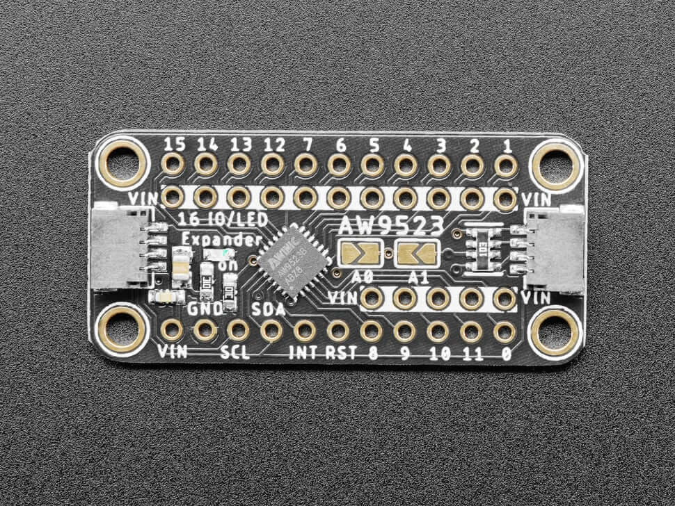

.. _adafruit_aw9523:

Adafruit AW9523 GPIO Expander and LED Driver
############################################

Overview
********

The `Adafruit AW9523 GPIO Expander and LED Driver` provides
16-channel GPIO/LED controller function.

   Adafruit AW9523 (Credit: Adafruit)

.. note::
   This shield has the STEMMA-QT/Qwiic connector, but devicetree defines it as
   an electrically compatible Grove connector.

Pin Assignments
===============

+--------------------------+------------------------------------------+
| Shield Pin               | Function                                 |
+==========================+==========================================+
| SDA                      | AW9523B I2C SDA                          |
+--------------------------+------------------------------------------+
| SCL                      | AW9523B I2C SCL                          |
+--------------------------+------------------------------------------+
| INT (Pad on board)       | AW9523B Interrupt output [1]_            |
+--------------------------+------------------------------------------+
| RST (Pad on board)       | AW9523B Reset pin [2]_                   |
+--------------------------+------------------------------------------+

.. [1] To receive interruption, connect the INT pin to the SoC's GPIO and set the connected
       GPIO in the ``intn-gpios`` property in an additional overlay. The INT terminal must be
       pulled up.

.. [2] If you want to control the reset pin from the SoC, connect it to a GPIO on the SoC
       and define the ``rstn-gpios`` property in an additional overlay.

Requirements
************

This shield can only be used with a board which provides a configuration for
STEMMA QT/Qwiic or Grove.
defines node aliases for SPI and GPIO interfaces (see :ref:`shields` for more details).

Programming
***********

Set ``--shield adafruit_aw9523`` when you invoke ``west build``. For example:

.. zephyr-app-commands::
    :zephyr-app: tests/drivers/rtc/rtc_api
    :board: m5stack_core2
    :shield: adafruit_aw9523
    :goals: build

.. _Adafruit AW9523 GPIO Expander and LED Driver:
    https://learn.adafruit.com/adafruit-aw9523-gpio-expander-and-led-driver

.. _Awinic AW9523B 16 MULTI-FUNCTION LED DRIVER AND GPIO CONTROLLER WITH I2C INTERFACE:
    https://doc.awinic.com/doc/202403/deffbf3b-7e7b-4ff6-8e91-fd85e2d845d5.pdf

.. _STEMMA/Grove comparison:
    https://learn.adafruit.com/introducing-adafruit-stemma-qt/seeed-studio-grove

.. _Grove to STEMMA QT/Qwiic/JST SH Cable:
    https://www.adafruit.com/product/4528
