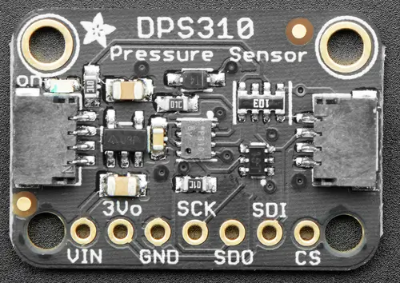

.. _adafruit_dps310:

Adafruit DPS310 Shield
######################

Overview
********

The `Adafruit DPS310 Precision Barometric Pressure and Altitude Sensor Shield`_ features
a `Infineon DPS310 Pressure Sensor`_ and two STEMMA QT connectors.
It measures air pressure and temperature.

   Adafruit DPS310 Shield (Credit: Adafruit)

Requirements
************

This shield can be used with boards which provide an I2C connector, for
example STEMMA QT or Qwiic connectors.
The target board must define a ``zephyr_i2c`` node label.
See :ref:`shields` for more details.

Pin Assignments
===============

+--------------+---------------------------+
| Shield Pin   | Function                  |
+==============+===========================+
| SDI          | DPS310 I2C SDA            |
+--------------+---------------------------+
| SCK          | DPS310 I2C SCL            |
+--------------+---------------------------+
| SDO          | DPS310 I2C address adjust |
+--------------+---------------------------+
| CS           | Not used in I2C mode      |
+--------------+---------------------------+

See :dtcompatible:`infineon,dps310` for documentation on how to adjust the
devicetree file.

Programming
***********

Set ``--shield adafruit_dps310`` when you invoke ``west build``. For example
when running the :zephyr:code-sample:`pressure_polling` pressure and temperature sample:

.. zephyr-app-commands::
   :zephyr-app: samples/sensor/pressure_polling
   :board: adafruit_qt_py_rp2040
   :shield: adafruit_dps310
   :goals: build

.. _Adafruit DPS310 Precision Barometric Pressure and Altitude Sensor Shield:
   https://learn.adafruit.com/adafruit-dps310-precision-barometric-pressure-sensor

.. _Infineon DPS310 Pressure Sensor:
   https://www.infineon.com/part/DPS310
