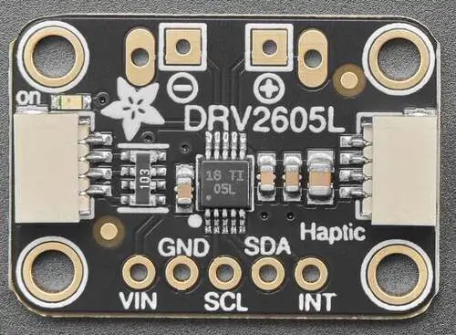

.. _adafruit_drv2605l:

Adafruit DRV2605L Shield
########################

Overview
********

The `Adafruit DRV2605L Haptic Motor Controller Shield`_ features
a `TI DRV2605 Haptic Driver`_ and two STEMMA QT connectors.
Note that DRV2605L is a low-voltage version of DRV2605.

   Adafruit DRV2605L Shield (Credit: Adafruit)

Requirements
************

This shield can be used with boards which provide an I2C connector, for
example STEMMA QT or Qwiic connectors.
The target board must define a ``zephyr_i2c`` node label.
See :ref:`shields` for more details.

Pin Assignments
===============

+--------------+---------------------------------------------+
| Shield Pin   | Function                                    |
+==============+=============================================+
| SDA          | DRV2605 I2C SDA                             |
+--------------+---------------------------------------------+
| SCL          | DRV2605 I2C SCL                             |
+--------------+---------------------------------------------+
| IN/TRIG      | Digital input for triggering haptic effects |
+--------------+---------------------------------------------+

The haptic motor could be of type eccentric rotating mass (ERM)
or linear resonant actuator (LRA).
By default an ERM motor is specified in the devicetree file for
this shield, as this is the type of motor that Adafruit sells with this shield.
Modify the devicetree file if you use an LRA motor;
see :dtcompatible:`ti,drv2605` for details.

Programming
***********

Set ``--shield adafruit_drv2605l`` when you invoke ``west build``. For example
when running the :zephyr:code-sample:`drv2605` haptics sample:

.. zephyr-app-commands::
   :zephyr-app: samples/drivers/haptics/drv2605
   :board: adafruit_qt_py_rp2040
   :shield: adafruit_drv2605l
   :goals: build

.. _Adafruit DRV2605L Haptic Motor Controller Shield:
   https://learn.adafruit.com/adafruit-drv2605-haptic-controller-breakout

.. _TI DRV2605 Haptic Driver:
   https://www.ti.com/product/DRV2605
