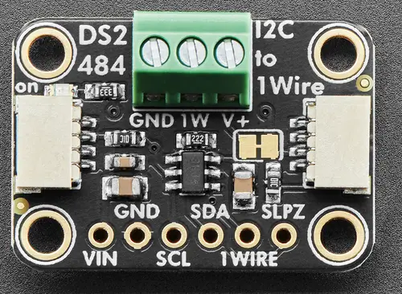

.. _adafruit_ds2484:

Adafruit DS2484 Shield
######################

Overview
********

The `Adafruit DS2484 I2C to 1-Wire Bus Adapter Shield`_ features
an `Analog Devices DS2484 1-Wire Master`_ and two STEMMA QT connectors.

   Adafruit DS2484 Shield (Credit: Adafruit)

Requirements
************

This shield can be used with boards which provide an I2C connector, for
example STEMMA QT or Qwiic connectors.
The target board must define a ``zephyr_i2c`` node label.
See :ref:`shields` for more details.

Pin Assignments
===============

+--------------+------------------------------+
| Shield Pin   | Function                     |
+==============+==============================+
| SDA          | DS2484 I2C SDA               |
+--------------+------------------------------+
| SCL          | DS2484 I2C SCL               |
+--------------+------------------------------+
| 1WIRE        | Connection to 1-Wire devices |
+--------------+------------------------------+
| SLPZ         | Digital input for sleep mode |
+--------------+------------------------------+

See :dtcompatible:`maxim,ds2484` for documentation on how to adjust the
devicetree file for sleep mode etc.

Programming
***********

Set ``--shield adafruit_ds2484`` when you invoke ``west build``. For example
when running the :zephyr:code-sample:`w1-scanner` 1-Wire scanning sample:

.. zephyr-app-commands::
   :zephyr-app: samples/drivers/w1/scanner
   :board: adafruit_qt_py_rp2040
   :shield: adafruit_ds2484
   :goals: build

Connect one or several 1-Wire devices to the shield before running the scanning sample.

.. _Adafruit DS2484 I2C to 1-Wire Bus Adapter Shield:
   https://learn.adafruit.com/adafruit-ds2484-i2c-to-1-wire-bus-adapter-breakout

.. _Analog Devices DS2484 1-Wire Master:
   https://www.analog.com/en/products/ds2484.html
