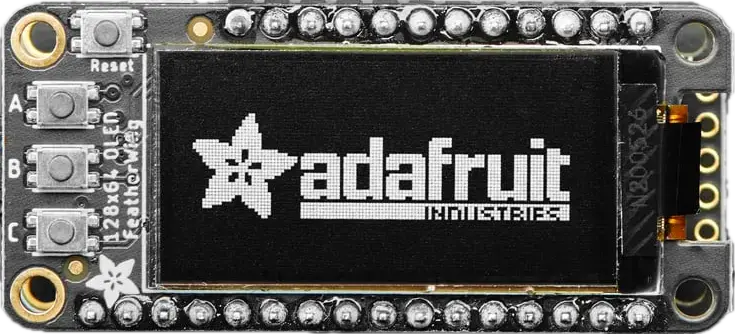

.. _adafruit_featherwing_128x64_oled:

Adafruit FeatherWing 128x64 OLED Shield
#######################################

Overview
********

The `Adafruit 128x64 OLED FeatherWing Shield`_ features a SH1106 compatible OLED display
with a resolution of 128x64 pixels and three user buttons.

   Adafruit FeatherWing 128x64 OLED Shield (Credit: Adafruit)

Pins Assignment of the Adafruit FeatherWing 128x64 OLED shield
==============================================================

+-----------------------+---------------------------------------------+
| Shield Connector Pin  | Function                                    |
+=======================+=============================================+
| SDA                   | SH1106 I2C SDA                              |
+-----------------------+---------------------------------------------+
| SCL                   | SH1106 I2C SCL                              |
+-----------------------+---------------------------------------------+
| GPIO5                 | Button C (INPUT_KEY_C)                      |
+-----------------------+---------------------------------------------+
| GPIO6                 | Button B (INPUT_KEY_B)                      |
+-----------------------+---------------------------------------------+
| GPIO9                 | Button A (INPUT_KEY_A)                      |
+-----------------------+---------------------------------------------+

Requirements
************

This shield can only be used with a board which provides a configuration for Feather connector and
defines a node alias for I2C (see :ref:`shields` for more details).

Programming
***********

Set ``--shield adafruit_featherwing_128x64_oled`` when you invoke ``west build``. For example:

.. zephyr-app-commands::
   :zephyr-app: samples/subsys/display/lvgl
   :board: adafruit_feather_nrf52840
   :shield: adafruit_featherwing_128x64_oled
   :goals: build

.. _Adafruit 128x64 OLED FeatherWing Shield:
   https://learn.adafruit.com/adafruit-128x64-oled-featherwing
