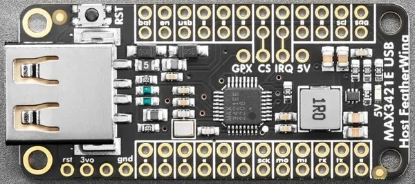

.. _adafruit_featherwing_max3421e:

Adafruit FeatherWing MAX3421E Shield
####################################

Overview
********

The `Adafruit USB Host FeatherWing with MAX3421E`_ provides a MAX3421E USB
Peripheral/Host controller connected over SPI.

   Adafruit FeatherWing MAX3421E Shield (Credit: Adafruit)

Pins Assignment of the Shield Connector
=======================================

+-----------------------+-----------------------------+
| Shield Connector Pin  | Function                    |
+=======================+=============================+
| D9                    | MAX3421E IRQ                |
+-----------------------+-----------------------------+
| D10                   | SPI CS                      |
+-----------------------+-----------------------------+
| SCK                   | SPI SCK                     |
+-----------------------+-----------------------------+
| MOSI                  | SPI MOSI                    |
+-----------------------+-----------------------------+
| MISO                  | SPI MISO                    |
+-----------------------+-----------------------------+

Programming
***********

Set ``--shield adafruit_featherwing_max3421e`` when you invoke ``west build``
in your Zephyr application.

.. _Adafruit USB Host FeatherWing with MAX3421E:
   https://learn.adafruit.com/adafruit-usb-host-featherwing-with-max3421e
