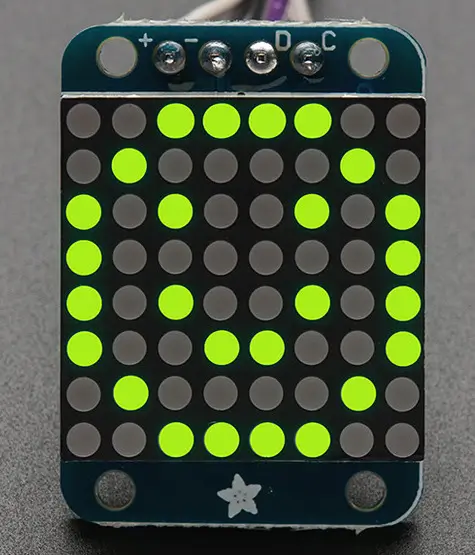

.. _adafruit_ht16k33:

Adafruit HT16K33 LED Matrix Shield
##################################

Overview
********

The `Adafruit Small 1.2 inch 8x8 LED Matrix with I2C Backpack`_ features
a `Holtek HT16K33 LED Controller Driver`_, an 8x8 LED matrix and two STEMMA QT connectors.

This shield definition can also be used with other shields having a HT16K33 LED
controller. The controller exposes up to 128 LEDs, and the mapping between a LED number
and a physical LED might differ on different shields.
See `Discussion on other LED backpacks`_.

   Adafruit 8x8 LED Matrix Shield (Credit: Adafruit)

Requirements
************

This shield can be used with boards which provide an I2C connector, for
example STEMMA QT or Qwiic connectors.
The target board must define a ``zephyr_i2c`` node label.
See :ref:`shields` for more details.

Pin Assignments
===============

+--------------+-------------------+
| Shield Pin   | Function          |
+==============+===================+
| SDA          | HT16K33 I2C SDA   |
+--------------+-------------------+
| SCL          | HT16K33 I2C SCL   |
+--------------+-------------------+

See :dtcompatible:`holtek,ht16k33` for documentation on devicetree settings.

Programming
***********

Set ``--shield adafruit_ht16k33`` when you invoke ``west build``. For example
when running the :zephyr:code-sample:`ht16k33` sample:

.. zephyr-app-commands::
   :zephyr-app: samples/drivers/ht16k33
   :board: adafruit_qt_py_rp2040
   :shield: adafruit_ht16k33
   :goals: build

.. _Adafruit Small 1.2 inch 8x8 LED Matrix with I2C Backpack:
   https://www.adafruit.com/product/1632

.. _Discussion on other LED backpacks:
   https://learn.adafruit.com/adafruit-led-backpack

.. _Holtek HT16K33 LED Controller Driver:
   https://www.holtek.com/page/vg/HT16K33A
