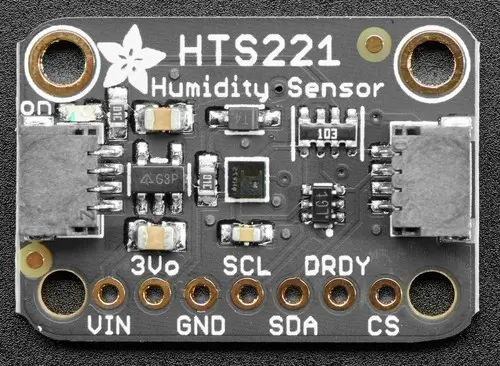

.. _adafruit_hts221:

Adafruit HTS221 Shield
######################

Overview
********

The `Adafruit HTS221 Temperature and Humidity Sensor Shield`_ features
a `ST Microelectronics HTS221 Humidity and Temperature Sensor`_ and two STEMMA QT connectors.
It measures temperature and humidity.

   Adafruit HTS221 Shield (Credit: Adafruit)

Requirements
************

This shield can be used with boards which provide an I2C connector, for example STEMMA QT or
Qwiic connectors. The target board must define a ``zephyr_i2c`` node label.
See :ref:`shields` for more details.

Pin Assignments
===============

+--------------+------------------------------------+
| Shield Pin   | Function                           |
+==============+====================================+
| SDA          | I2C SDA                            |
+--------------+------------------------------------+
| SCL          | I2C SCL                            |
+--------------+------------------------------------+
| DRDY         | Data ready output                  |
+--------------+------------------------------------+
| CS           | Keep at high level to use I2C mode |
+--------------+------------------------------------+

See :dtcompatible:`st,hts221` for details on possible devicetree settings, for example if you
are using the DRDY pin.

Programming
***********

Set ``--shield adafruit_hts221`` when you invoke ``west build``. For example
when running the :zephyr:code-sample:`dht_polling` sample:

.. zephyr-app-commands::
   :zephyr-app: samples/sensor/dht_polling
   :board: adafruit_feather_scorpio_rp2040
   :shield: adafruit_hts221
   :goals: build flash

.. _Adafruit HTS221 Temperature and Humidity Sensor Shield:
   https://learn.adafruit.com/adafruit-hts221-temperature-humidity-sensor

.. _ST Microelectronics HTS221 Humidity and Temperature Sensor:
   https://www.st.com/resource/en/datasheet/hts221.pdf
