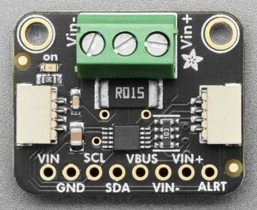

.. _adafruit_ina228:

Adafruit INA228 Shield
#############################

Overview
********

The `Adafruit INA228 High or Low Side Power Monitor`_ features the
`TI INA228 current sensor`_, an I2C 20-bit power monitoring chip, with two
STEMMA QT connectors. This board is capable of measuring up to 85VDC
common-mode, high or low side measurements ranging from milli-amps to amps.

   Adafruit INA228 Shield (Credit: Adafruit)

Requirements
************

This shield can be used with boards which provide an I2C connector, for
example STEMMA QT or Qwiic connectors.
The target board must define a ``zephyr_i2c`` node label.
See :ref:`shields` for more details.

Pin Assignments
===============

+--------------+-------------------+
| Shield Pin   | Function          |
+==============+===================+
| SDA          | INA228 I2C SDA    |
+--------------+-------------------+
| SCL          | INA228 I2C SCL    |
+--------------+-------------------+
| ALRT         | INA228 ALERT out  |
+--------------+-------------------+
| VIN-         | Current sense neg |
+--------------+-------------------+
| VIN+         | Current sense pos |
+--------------+-------------------+
| VBUS         | Voltage sense     |
+--------------+-------------------+

See :dtcompatible:`ti,ina228` for documentation on how to adjust the
devicetree file, for example to adjust the sample averaging.

Programming
***********

Set ``--shield adafruit_ina228`` when you invoke ``west build``. For example
when running the :zephyr:code-sample:`sensor_shell` sample:

.. zephyr-app-commands::
   :zephyr-app: samples/sensor/sensor_shell
   :board: adafruit_qt_py_rp2040
   :shield: adafruit_ina228
   :goals: build

.. _Adafruit INA228 High or Low Side Power Monitor:
   https://learn.adafruit.com/adafruit-ina228-i2c-power-monitor/

.. _TI INA228 Current sensor:
   https://www.ti.com/product/INA228
