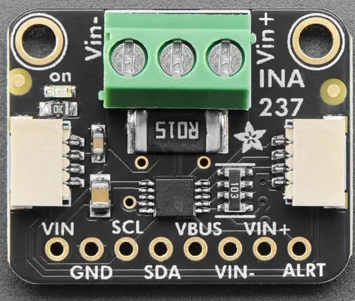

.. _adafruit_ina237:

Adafruit INA237 Shield
######################

Overview
********

The `Adafruit INA237 DC Current Voltage Power Monitor Sensor Shield`_ features
a `TI INA237 current sensor`_ and two STEMMA QT connectors.
It measures current and bus voltage.

   Adafruit INA237 Shield (Credit: Adafruit)

Requirements
************

This shield can be used with boards which provide an I2C connector, for
example STEMMA QT or Qwiic connectors.
The target board must define a ``zephyr_i2c`` node label.
See :ref:`shields` for more details.

Pin Assignments
===============

+--------------+-------------------+
| Shield Pin   | Function          |
+==============+===================+
| SDA          | INA237 I2C SDA    |
+--------------+-------------------+
| SCL          | INA237 I2C SCL    |
+--------------+-------------------+
| ALRT         | INA237 ALERT out  |
+--------------+-------------------+

See :dtcompatible:`ti,ina237` for documentation on how to adjust the
devicetree file, for example to adjust the sample averaging.

Programming
***********

Set ``--shield adafruit_ina237`` when you invoke ``west build``. For example
when running the :zephyr:code-sample:`sensor_shell` sample:

.. zephyr-app-commands::
   :zephyr-app: samples/sensor/sensor_shell
   :board: adafruit_qt_py_rp2040
   :shield: adafruit_ina237
   :goals: build

.. _Adafruit INA237 DC Current Voltage Power Monitor Sensor Shield:
   https://learn.adafruit.com/adafruit-ina237-dc-current-voltage-power-monitor

.. _TI INA237 Current sensor:
   https://www.ti.com/product/INA237
