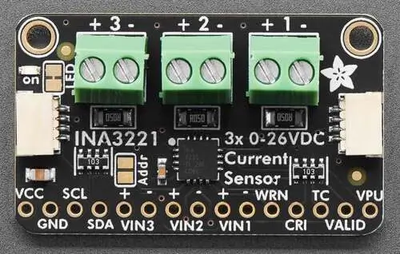

.. _adafruit_ina3221:

Adafruit INA3221 Shield
#######################

Overview
********

The `Adafruit INA3221 Triple Power Monitor Shield`_ features
a `TI INA3221 current sensor`_ and two STEMMA QT connectors.
It measures current and bus voltage on three channels.

   Adafruit INA3221 Shield (Credit: Adafruit)

Requirements
************

This shield can be used with boards which provide an I2C connector, for example STEMMA QT
or Qwiic connectors. The target board must define a ``zephyr_i2c`` node label.
See :ref:`shields` for more details.

Pin Assignments
===============

+--------------+-------------------------------+
| Shield Pin   | Function                      |
+==============+===============================+
| SCL          | I2C SCL                       |
+--------------+-------------------------------+
| SDA          | I2C SDA                       |
+--------------+-------------------------------+
| VIN3+        | Current sense pos, channel 3  |
+--------------+-------------------------------+
| VIN3-        | Current sense neg, channel 3  |
+--------------+-------------------------------+
| VIN2+        | Current sense pos, channel 2  |
+--------------+-------------------------------+
| VIN2-        | Current sense neg, channel 2  |
+--------------+-------------------------------+
| VIN1+        | Current sense pos, channel 1  |
+--------------+-------------------------------+
| VIN1-        | Current sense neg, channel 1  |
+--------------+-------------------------------+
| WRN          | Interrupt for current level   |
+--------------+-------------------------------+
| CRI          | Interrupt for overcurrent     |
+--------------+-------------------------------+
| TC           | Interrupt for timing control  |
+--------------+-------------------------------+
| VALID        | Interrupt for power valid     |
+--------------+-------------------------------+
| VPU          | Pull up voltage for VALID pin |
+--------------+-------------------------------+

See :dtcompatible:`ti,ina3221` for documentation on how to adjust the
devicetree file, for example to adjust the sample averaging.

Programming
***********

Set ``--shield adafruit_ina3221`` when you invoke ``west build``. For example
when running the :zephyr:code-sample:`sensor_shell` sample:

.. zephyr-app-commands::
   :zephyr-app: samples/sensor/sensor_shell
   :board: adafruit_feather_canbus_rp2040
   :shield: adafruit_ina3221
   :goals: build flash

Use the shell command to show voltage, current and power on channel 1. This example has a
voltage and current of approximately 5 Volt and 3 mA, respectively:

.. code-block:: console

    uart:~$ sensor get ina3221@40
    channel type=33(voltage) index=0 shift=3 num_samples=1 value=63920453436ns (5.079999)
    channel type=35(current) index=0 shift=3 num_samples=1 value=63920453436ns (0.003199)
    channel type=36(power) index=0 shift=3 num_samples=1 value=63920453436ns (0.016255)

Use this command to select channel 2 instead of channel 1:

.. code-block:: console

    uart:~$ sensor attr_set ina3221@40 voltage 19 2

.. _Adafruit INA3221 Triple Power Monitor Shield:
   https://learn.adafruit.com/adafruit-ina3221-breakout

.. _TI INA3221 Current sensor:
   https://www.ti.com/product/INA3221
