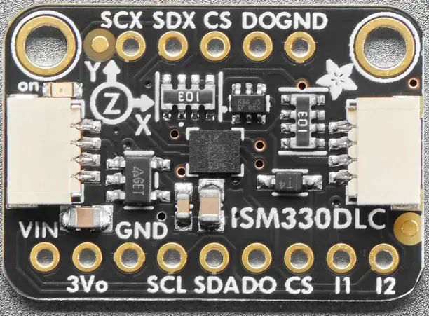

.. _adafruit_ism330dhcx:

Adafruit ISM330DHCX Shield
##########################

Overview
********

The `Adafruit ISM330DHCX 6 DoF IMU Sensor Shield`_ features
a `ST ISM330DHCX 6 DoF IMU`_ and two STEMMA QT connectors.

   Adafruit ISM330DHCX Shield (Credit: Adafruit)

Requirements
************

This shield can be used with boards which provide an I2C connector, for
example STEMMA QT or Qwiic connectors.
The target board must define a ``zephyr_i2c`` node label.
See :ref:`shields` for more details.

Pin Assignments
===============

+--------------+---------------------------------------------------------+
| Shield Pin   | Function                                                |
+==============+=========================================================+
| SDA          | ISM330DHCX I2C SDA                                      |
+--------------+---------------------------------------------------------+
| SCL          | ISM330DHCX I2C SCL                                      |
+--------------+---------------------------------------------------------+
| DO           | ISM330DHCX I2C address selection. Pull down by default. |
+--------------+---------------------------------------------------------+
| CS           | ISM330DHCX Force I2C mode by setting it to high level.  |
+--------------+---------------------------------------------------------+
| I1           | ISM330DHCX Interrupt out                                |
+--------------+---------------------------------------------------------+
| I2           | ISM330DHCX Second interrupt out                         |
+--------------+---------------------------------------------------------+

In order to use interrupts you need to connect a separate wire from the
shield to a GPIO pin on your microcontroller board. See
:dtcompatible:`st,ism330dhcx` for documentation on how to adjust the
devicetree file.

Programming
***********

Set ``--shield adafruit_ism330dhcx`` when you invoke ``west build``.
For example when running the :zephyr:code-sample:`accel_polling` sample:

.. zephyr-app-commands::
   :zephyr-app: samples/sensor/accel_polling
   :board: adafruit_qt_py_rp2040
   :shield: adafruit_ism330dhcx
   :goals: build

.. _Adafruit ISM330DHCX 6 DoF IMU Sensor Shield:
   https://learn.adafruit.com/lsm6dsox-and-ism330dhc-6-dof-imu/

.. _ST ISM330DHCX 6 DoF IMU:
   https://www.st.com/en/mems-and-sensors/ism330dhcx.html
