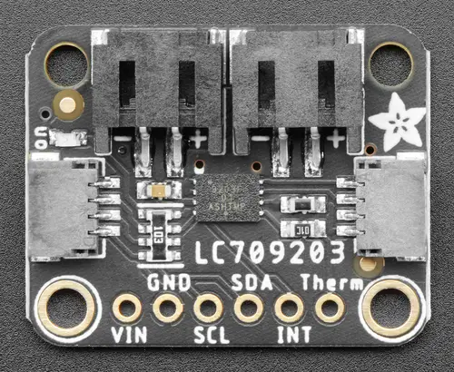

.. _adafruit_lc709203f:

Adafruit LC709203F Shield
#########################

Overview
********

The `Adafruit LC709203F Fuel Gauge Shield`_ features an `Onsemi LC709203F Fuel Gauge`_ and
two STEMMA QT connectors. It measures voltage and state-of-charge of a lithium ion or lithium
polymer cell.

   Adafruit LC709203F Shield (Credit: Adafruit)

Requirements
************

This shield can be used with boards which provide an I2C connector, for example STEMMA QT
or Qwiic connectors. The target board must define a ``zephyr_i2c`` node label.
See :ref:`shields` for more details.

Pin Assignments
===============

+--------------+--------------------------------------------------------------------+
| Shield Pin   | Function                                                           |
+==============+====================================================================+
| SCL          | I2C SCL                                                            |
+--------------+--------------------------------------------------------------------+
| SDA          | I2C SDA                                                            |
+--------------+--------------------------------------------------------------------+
| INT          | Interrupt output                                                   |
+--------------+--------------------------------------------------------------------+
| Therm        | Use a 10 kOhm thermisor to GND for battery temperature measurement |
+--------------+--------------------------------------------------------------------+

See :dtcompatible:`onnn,lc709203f` for documentation on how to adjust the devicetree file,
for example to set the approximate cell capacity.

Programming
***********

Set ``--shield adafruit_lc709203f`` when you invoke ``west build``. For example when running
the :zephyr:code-sample:`fuel_gauge` sample:

.. zephyr-app-commands::
   :zephyr-app: samples/drivers/fuel_gauge
   :board: adafruit_feather_adalogger_rp2040
   :shield: adafruit_lc709203f
   :goals: build flash

.. _Adafruit LC709203F Fuel Gauge Shield:
   https://learn.adafruit.com/adafruit-lc709203f-lipo-lipoly-battery-monitor

.. _Onsemi LC709203F Fuel Gauge:
   https://www.onsemi.com/products/power-management/battery-management/battery-fuel-gauges/lc709204f
