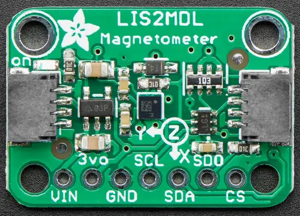

.. _adafruit_lis2mdl:

Adafruit LIS2MDL Shield
#######################

Overview
********

The `Adafruit LIS2MDL Triple-axis Magnetometer Sensor Shield`_ features
a `ST LIS2MDL Magnetometer Sensor`_ and two STEMMA QT connectors.

   Adafruit LIS2MDL Shield (Credit: Adafruit)

Requirements
************

This shield can be used with boards which provide an I2C connector, for
example STEMMA QT or Qwiic connectors.
The target board must define a ``zephyr_i2c`` node label.
See :ref:`shields` for more details.

Pin Assignments
===============

+--------------+----------------------+
| Shield Pin   | Function             |
+==============+======================+
| SDA          | LIS2MDL I2C SDA      |
+--------------+----------------------+
| SCL          | LIS2MDL I2C SCL      |
+--------------+----------------------+
| SDO          | Not used in I2C mode |
+--------------+----------------------+
| CS           | Not used in I2C mode |
+--------------+----------------------+

See :dtcompatible:`st,lis2mdl` for documentation on devicetree settings.

Programming
***********

Set ``--shield adafruit_lis2mdl`` when you invoke ``west build``. For example
when running the :zephyr:code-sample:`magn_polling` magnetometer sample:

.. zephyr-app-commands::
   :zephyr-app: samples/sensor/magn_polling
   :board: adafruit_qt_py_rp2040
   :shield: adafruit_lis2mdl
   :goals: build

.. _Adafruit LIS2MDL Triple-axis Magnetometer Sensor Shield:
   https://learn.adafruit.com/adafruit-lis2mdl-triple-axis-magnetometer

.. _ST LIS2MDL Magnetometer Sensor:
   https://www.st.com/en/mems-and-sensors/lis2mdl.html
