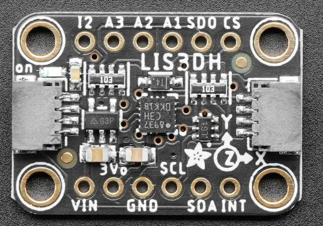

.. _adafruit_lis3dh:

Adafruit LIS3DH Shield
######################

Overview
********

The `Adafruit LIS3DH Triple-Axis Accelerometer Sensor Shield`_ features
a `ST LIS3DH 3-axis accelerometer`_ and two STEMMA QT connectors.

   Adafruit LIS3DH Shield (Credit: Adafruit)

Requirements
************

This shield can be used with boards which provide an I2C connector, for
example STEMMA QT or Qwiic connectors.
The target board must define a ``zephyr_i2c`` node label.
See :ref:`shields` for more details.

Pin Assignments
===============

+--------------+------------------------------------------------------+
| Shield Pin   | Function                                             |
+==============+======================================================+
| SDA          | LIS3DH I2C SDA                                       |
+--------------+------------------------------------------------------+
| SCL          | LIS3DH I2C SCL                                       |
+--------------+------------------------------------------------------+
| INT          | LIS3DH Interrupt out                                 |
+--------------+------------------------------------------------------+
| SDO          | LIS3DH I2C address selection. Pull down by default.  |
+--------------+------------------------------------------------------+
| CS           | LIS3DH Force I2C mode by setting it to high level.   |
+--------------+------------------------------------------------------+
| I2           | LIS3DH Second interrupt out                          |
+--------------+------------------------------------------------------+
| A1-A3        | LIS3DH Analog-to-digital converter inputs. Not used. |
+--------------+------------------------------------------------------+

In order to use interrupts you need to connect a separate wire from the
shield to a GPIO pin on your microcontroller board. See
:dtcompatible:`st,lis3dh` for documentation on how to adjust the
devicetree file.

Programming
***********

Set ``--shield adafruit_lis3dh`` when you invoke ``west build``. For example
when running the :zephyr:code-sample:`accel_polling` sample:

.. zephyr-app-commands::
   :zephyr-app: samples/sensor/accel_polling
   :board: adafruit_qt_py_rp2040
   :shield: adafruit_lis3dh
   :goals: build

.. _Adafruit LIS3DH Triple-Axis Accelerometer Sensor Shield:
   https://learn.adafruit.com/adafruit-lis3dh-triple-axis-accelerometer-breakout

.. _ST LIS3DH 3-axis accelerometer:
   https://www.st.com/en/mems-and-sensors/lis3dh.html
