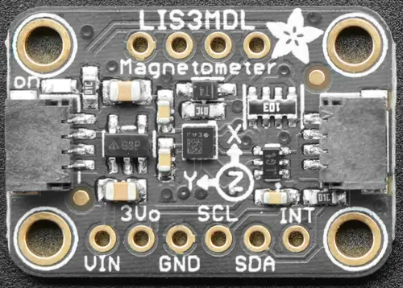

.. _adafruit_lis3mdl:

Adafruit LIS3MDL Shield
#######################

Overview
********

The `Adafruit LIS3MDL Triple-Axis Magnetometer Sensor Shield`_ features
a `ST LIS3MDL 3-axis magnetometer`_ and two STEMMA QT connectors.

   Adafruit LIS3MDL Shield (Credit: Adafruit)

Requirements
************

This shield can be used with boards which provide an I2C connector, for
example STEMMA QT or Qwiic connectors.
The target board must define a ``zephyr_i2c`` node label.
See :ref:`shields` for more details.

Pin Assignments
===============

+--------------+------------------------------------------------------+
| Shield Pin   | Function                                             |
+==============+======================================================+
| SDA          | LIS3MDL I2C SDA                                      |
+--------------+------------------------------------------------------+
| SCL          | LIS3MDL I2C SCL                                      |
+--------------+------------------------------------------------------+
| INT          | LIS3MDL Interrupt out                                |
+--------------+------------------------------------------------------+
| DO/AD1       | LIS3MDL I2C address select pin                       |
+--------------+------------------------------------------------------+
| CS           | LIS3MDL Force I2C mode by setting it to high level.  |
+--------------+------------------------------------------------------+
| DRDY         | LIS3MDL Data ready out                               |
+--------------+------------------------------------------------------+

In order to use the DRDY output you need to connect a separate wire from the
shield to a GPIO pin on your microcontroller board. See
:dtcompatible:`st,lis3mdl-magn` for documentation on how to adjust the
devicetree file.

Programming
***********

Set ``--shield adafruit_lis3mdl`` when you invoke ``west build``. For example
when running the :zephyr:code-sample:`magn_polling` sample:

.. zephyr-app-commands::
   :zephyr-app: samples/sensor/magn_polling
   :board: adafruit_feather_rp2040
   :shield: adafruit_lis3mdl
   :goals: build flash

.. _Adafruit LIS3MDL Triple-Axis Magnetometer Sensor Shield:
   https://learn.adafruit.com/lis3mdl-triple-axis-magnetometer

.. _ST LIS3MDL 3-axis magnetometer:
   https://www.st.com/en/mems-and-sensors/lis3mdl.html
