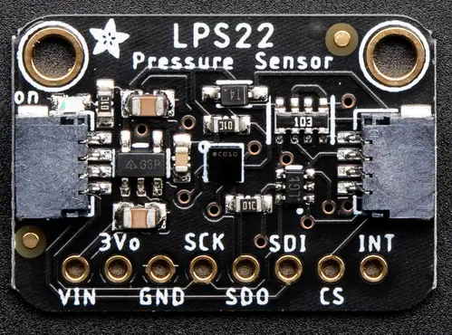

.. _adafruit_lps22:

Adafruit LPS22 Shield
#####################

Overview
********

The `Adafruit LPS22 Pressure Sensor Shield`_ features
a `ST Microelectronics LPS22HB Pressure Sensor`_ and two STEMMA QT connectors.
It measures air pressure and temperature.

   Adafruit LPS22 Shield (Credit: Adafruit)

Requirements
************

This shield can be used with boards which provide an I2C connector, for
example STEMMA QT or Qwiic connectors.
The target board must define a ``zephyr_i2c`` node label.
See :ref:`shields` for more details.

Pin Assignments
===============

+--------------+-------------------------------------+
| Shield Pin   | Function                            |
+==============+=====================================+
| SCK          | LPS22 I2C SCL                       |
+--------------+-------------------------------------+
| SDI          | LPS22 I2C SDA                       |
+--------------+-------------------------------------+
| SDO          | LPS22 I2C address adjust            |
+--------------+-------------------------------------+
| CS           | LPS22 mode. Pulled high to use I2C. |
+--------------+-------------------------------------+
| INT          | LPS22 interrupt out                 |
+--------------+-------------------------------------+

See :dtcompatible:`st,lps22hb-press` for documentation on how to adjust the
devicetree file.

Programming
***********

Set ``--shield adafruit_lps22`` when you invoke ``west build``. For example
when running the :zephyr:code-sample:`pressure_polling` pressure and temperature sample:

.. zephyr-app-commands::
   :zephyr-app: samples/sensor/pressure_polling
   :board: adafruit_feather_rp2040
   :shield: adafruit_lps22
   :goals: build flash

.. _Adafruit LPS22 Pressure Sensor Shield:
   https://learn.adafruit.com/adafruit-lps25-pressure-sensor

.. _ST Microelectronics LPS22HB Pressure Sensor:
   https://www.st.com/en/mems-and-sensors/lps22hb.html
