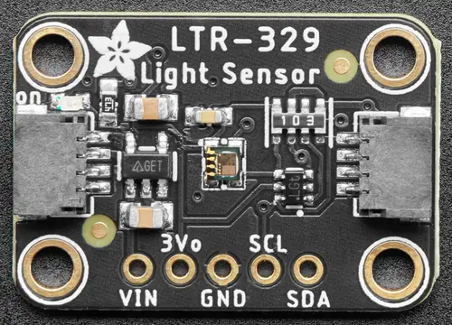

.. _adafruit_ltr329:

Adafruit LTR-329 Shield
#######################

Overview
********

The `Adafruit LTR-329 Light Sensor Shield`_ features a `LiteOn LTR-329ALS-01 Digital Light Sensor`_
and two STEMMA QT connectors.

   Adafruit LTR-329 Shield (Credit: Adafruit)

Requirements
************

This shield can be used with boards which provide an I2C connector, for example STEMMA QT or
Qwiic connectors. The target board must define a ``zephyr_i2c`` node label. See :ref:`shields` for
more details.

Pin Assignments
===============

+--------------+-----------------------+
| Shield Pin   | Function              |
+==============+=======================+
| SDA          | LTR-329 I2C SDA       |
+--------------+-----------------------+
| SCL          | LTR-329 I2C SCL       |
+--------------+-----------------------+

See :dtcompatible:`liteon,ltr329` for documentation on how to adjust the devicetree file, to for
example adjust the integration time.

Programming
***********

Set ``--shield adafruit_ltr329`` when you invoke ``west build``.  For example when running the
:zephyr:code-sample:`light_sensor_polling` light measurement sample:

.. zephyr-app-commands::
   :zephyr-app: samples/sensor/light_polling
   :board: adafruit_metro_rp2040
   :shield: adafruit_ltr329
   :goals: build

.. _Adafruit LTR-329 Light Sensor Shield:
   https://learn.adafruit.com/adafruit-ltr-329-ltr-303

.. _LiteOn LTR-329ALS-01 Digital Light Sensor:
   https://optoelectronics.liteon.com/upload/download/DS86-2014-0006/LTR-329ALS-01_DS_V1.8.PDF
