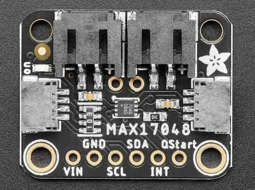

.. _adafruit_max17048:

Adafruit MAX17048 Shield
########################

Overview
********

The `Adafruit MAX17048 Fuel Gauge Shield`_ features
an `Analog Devices MAX17048 Fuel Gauge`_ and two STEMMA QT connectors.
It measures voltage and state-of-charge of a lithium ion or lithium polymer cell.

   Adafruit MAX17048 Shield (Credit: Adafruit)

Requirements
************

This shield can be used with boards which provide an I2C connector, for example STEMMA QT
or Qwiic connectors. The target board must define a ``zephyr_i2c`` node label.
See :ref:`shields` for more details.

Pin Assignments
===============

+--------------+-------------------------------+
| Shield Pin   | Function                      |
+==============+===============================+
| SCL          | I2C SCL                       |
+--------------+-------------------------------+
| SDA          | I2C SDA                       |
+--------------+-------------------------------+
| INT          | Interrupt output              |
+--------------+-------------------------------+
| QStart       | Quick-start reset input       |
+--------------+-------------------------------+

See :dtcompatible:`maxim,max17048` for documentation on how to adjust the devicetree file.

Programming
***********

Set ``--shield adafruit_max17048`` when you invoke ``west build``. For example when running
the :zephyr:code-sample:`fuel_gauge` sample:

.. zephyr-app-commands::
   :zephyr-app: samples/drivers/fuel_gauge
   :board: adafruit_feather_canbus_rp2040
   :shield: adafruit_max17048
   :goals: build flash

.. _Adafruit MAX17048 Fuel Gauge Shield:
   https://learn.adafruit.com/adafruit-max17048-lipoly-liion-fuel-gauge-and-battery-monitor

.. _Analog Devices MAX17048 Fuel Gauge:
   https://www.analog.com/en/products/max17048.html
