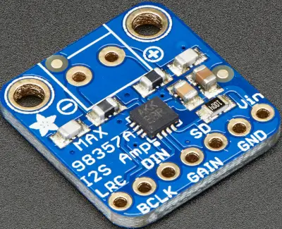

.. _adafruit_max98357a:

Adafruit MAX98357A I2S Class-D Mono Amplifier
#############################################

Overview
********

The `Adafruit MAX98357A I2S Class-D Mono Amplifier`_ breakout carries the `Maxim MAX98357A`_,
a PCM input class D amplifier. It takes I2S audio at 8 kHz to 96 kHz with 16, 24 or 32 bit
samples and drives a 4 ohm or 8 ohm speaker from a 2.5 V to 5.5 V supply. The amplifier needs
no MCLK and has no control bus: the I2S word clock, bit clock and data line are its only
digital inputs.

   Adafruit MAX98357A I2S Class-D Mono Amplifier (Image courtesy of Adafruit, taken from the
   `Adafruit MAX98357A I2S Class-D Mono Amplifier`_ guide)

Requirements
************

The breakout has no board connector; its pins are wired to the I2S signals of the host board.
The board must define an ``arduino_i2s`` node label for the I2S controller it exposes, and the
controller must generate the bit and word clocks (controller mode). See :ref:`shields` for
more details.

Pin Assignments
===============

+------------+-----------------------------------------------+
| Shield Pin | Function                                      |
+============+===============================================+
| Vin        | Supply, 2.5 V to 5.5 V                        |
+------------+-----------------------------------------------+
| GND        | Ground                                        |
+------------+-----------------------------------------------+
| LRC        | I2S word select                               |
+------------+-----------------------------------------------+
| BCLK       | I2S bit clock                                 |
+------------+-----------------------------------------------+
| DIN        | I2S serial data                               |
+------------+-----------------------------------------------+
| SD         | Shutdown and channel select [1]_              |
+------------+-----------------------------------------------+
| GAIN       | Amplifier gain select [2]_                    |
+------------+-----------------------------------------------+

The speaker connects to the two screw terminals. The output is bridge tied, so neither
terminal may be connected to ground.

.. [1] The breakout pulls SD to Vin through a 1 megaohm resistor. Together with the
       on-chip 100 kiloohm pull-down this sets about 0.45 V from a 5 V supply, which plays the
       (left + right) / 2 mix, so the pin can be left unconnected. The amplifier shuts down
       below 0.16 V, plays the mix from 0.16 V to 0.77 V, the right channel from 0.77 V to
       1.4 V and the left channel above 1.4 V. To let the driver switch the amplifier on and
       off, connect SD to a GPIO of the board and set the ``sdmode-gpios`` property of the
       amplifier node in an additional overlay; a GPIO driven high then selects the left
       channel.

.. [2] The gain is 9 dB with GAIN unconnected, 12 dB with GAIN tied to GND, 6 dB with GAIN
       tied to Vin, 15 dB with a 100 kiloohm resistor from GAIN to GND and 3 dB with a
       100 kiloohm resistor from GAIN to Vin.

On :zephyr:board:`nucleo_f411re` the I2S signals are on the Arduino header: LRC on A2,
BCLK on D13 and DIN on D11. The shield disables the SPI controller that shares these pins.

Programming
***********

Set ``--shield adafruit_max98357a`` when you invoke ``west build``. The shield sets the
``i2s_tx`` alias used by the :zephyr:code-sample:`i2s-output` sample, which plays a short sine
wave through the amplifier:

.. zephyr-app-commands::
   :zephyr-app: samples/drivers/i2s/output
   :board: nucleo_f411re
   :shield: adafruit_max98357a
   :goals: build flash
   :compact:

See :dtcompatible:`maxim,max98357a` for the devicetree properties of the amplifier.

.. _Adafruit MAX98357A I2S Class-D Mono Amplifier:
   https://learn.adafruit.com/adafruit-max98357-i2s-class-d-mono-amp

.. _Maxim MAX98357A:
   https://www.analog.com/en/products/max98357a.html
