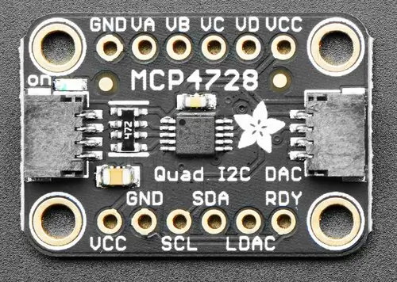

.. _adafruit_mcp4728:

Adafruit MCP4728 Quad DAC Shield
################################

Overview
********

The `Adafruit MCP4728 Quad DAC Shield`_ features a `Microchip 12-Bit Quad Output DAC`_ and
two STEMMA QT connectors. It has four output channels and an internal voltage reference.

   Adafruit MCP4728 DAC Shield (Credit: Adafruit)

Requirements
************

This shield can be used with boards which provide an I2C connector, for
example STEMMA QT or Qwiic connectors.
The target board must define a ``zephyr_i2c`` node label.
See :ref:`shields` for more details.

Pin Assignments
===============

+--------------+-------------------------------------------------+
| Shield Pin   | Function                                        |
+==============+=================================================+
| SCL          | MCP4728 I2C SCL                                 |
+--------------+-------------------------------------------------+
| SDA          | MCP4728 I2C SDA                                 |
+--------------+-------------------------------------------------+
| LDAC         | MCP4728 load DAC input                          |
+--------------+-------------------------------------------------+
| RDY          | MCP4728 ready. Low when busy with EEPROM write. |
+--------------+-------------------------------------------------+
| VA - VD      | MCP4728 output channels                         |
+--------------+-------------------------------------------------+

When using this shield via the STEMMA QT connector, the supply voltage is 3.3 Volt, so the
maximum internal voltage reference that can be used is 2.048 Volt.

The LDAC pin is pulled down on the shield, forcing an updated output voltage as soon as
the input register has been written.

See :dtcompatible:`microchip,mcp4728` for documentation on how to adjust the
devicetree file, for example to adjust the voltage reference, gain or power-down mode.

Programming
***********

Set ``--shield adafruit_mcp4728`` when you invoke ``west build``. For example
when running the :zephyr:code-sample:`dac` sample:

.. zephyr-app-commands::
   :zephyr-app: samples/drivers/dac
   :board: adafruit_feather_adalogger_rp2040
   :shield: adafruit_mcp4728
   :goals: build flash

Connect a voltmeter to the shield output ``VA`` and observe how the voltage changes.
To run the sample for another output channel, modify the value for the ``dac-channel-id``
attribute in the .overlay file for this shield.

.. _Adafruit MCP4728 Quad DAC Shield:
   https://learn.adafruit.com/adafruit-mcp4728-i2c-quad-dac

.. _Microchip 12-Bit Quad Output DAC:
   https://www.microchip.com/en-us/product/mcp4728
