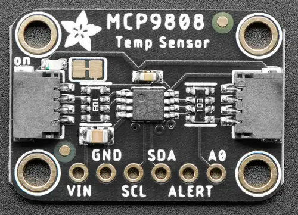

.. _adafruit_mcp9808:

Adafruit MCP9808 Shield
#######################

Overview
********

The `Adafruit MCP9808 High Accuracy I2C Temperature Sensor Shield`_ features
a `Microchip MCP9808 Temperature Sensor`_ and two STEMMA QT connectors.

   Adafruit MCP9808 Shield (Credit: Adafruit)

Requirements
************

This shield can be used with boards which provide an I2C connector, for
example STEMMA QT or Qwiic connectors.
The target board must define a ``zephyr_i2c`` node label.
See :ref:`shields` for more details.

Pin Assignments
===============

+--------------+-----------------------+
| Shield Pin   | Function              |
+==============+=======================+
| SDA          | MCP9808 I2C SDA       |
+--------------+-----------------------+
| SCL          | MCP9808 I2C SCL       |
+--------------+-----------------------+
| A0           | MCP9808 I2C address   |
+--------------+-----------------------+
| ALERT        | MCP9808 interrupt out |
+--------------+-----------------------+

In order to use interrupts you need to connect a separate wire from the
shield to a GPIO pin on your microcontroller board. See
:dtcompatible:`jedec,jc-42.4-temp` for documentation on how to adjust the
devicetree file.

Programming
***********

Set ``--shield adafruit_mcp9808`` when you invoke ``west build``.  For example
when running the :zephyr:code-sample:`jc42` temperature measurement sample:

.. zephyr-app-commands::
   :zephyr-app: samples/sensor/jc42
   :board: adafruit_qt_py_rp2040
   :shield: adafruit_mcp9808
   :goals: build

.. _Adafruit MCP9808 High Accuracy I2C Temperature Sensor Shield:
   https://learn.adafruit.com/adafruit-mcp9808-precision-i2c-temperature-sensor-guide

.. _Microchip MCP9808 Temperature Sensor:
   https://www.microchip.com/en-us/product/mcp9808
