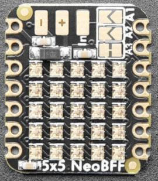

.. _adafruit_neopixel_grid_bff:

Adafruit 5x5 NeoPixel Grid BFF
##############################

Overview
********

The `Adafruit 5x5 NeoPixel Grid BFF`_ is a 5x5 grid of WS2812B RGB LEDs,
which Adafruit refers to as "neopixels". The BFF series of shields are
designed to be compatible with any Adafruit Qt Py or Seeed Studio Xiao
board.

   Adafruit 5x5 NeoPixel Grid BFF (Credit: Adafruit)

Pin Assignments
===============

+-----------------------+---------------------------------------------+
| Shield Connector Pin  | Function                                    |
+=======================+=============================================+
| A3                    | WS2812B driver pin [1]_                     |
+-----------------------+---------------------------------------------+

.. [1] This is the default pin when the board is delivered as is by Adafruit.
       It can be changed away from the default using the onboard solder jumpers,
       but this shield will no longer work without a matching device tree update.

Programming
***********

LED Strip Example
=================

Set ``--shield adafruit_neopixel_grid_bff`` when you invoke ``west build``. For example:

.. zephyr-app-commands::
   :zephyr-app: samples/drivers/led/led_strip
   :board: adafruit_qt_py_rp2040
   :shield: adafruit_neopixel_grid_bff
   :goals: build

LED Display Matrix Example
==========================

.. warning::

    When using this example, all of the LEDs will be set to their maximum
    brightness. Having all of the LEDs on at once can cause the PCB to overheat
    or draw too much current from any on-board voltage regulators.
    Adafruit does provide solder pads for your own power supply on the
    underside of the BFF for this reason. It is not required, but is strongly
    recommended if all of the LEDs are fully on for any significant amount of
    time.

Set ``--shield adafruit_neopixel_grid_bff_display`` when you invoke ``west build``. For example:

.. zephyr-app-commands::
   :zephyr-app: samples/drivers/display
   :board: adafruit_qt_py_rp2040
   :shield: adafruit_neopixel_grid_bff_display
   :goals: build

.. _Adafruit 5x5 NeoPixel Grid BFF:
   https://learn.adafruit.com/adafruit-5x5-neopixel-grid-bff/
