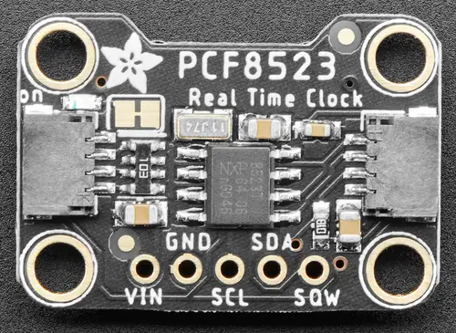

.. _adafruit_pcf8523:

Adafruit PCF8523 Shield
#######################

Overview
********

The `Adafruit PCF8523 Real Time Clock Shield`_ features
an `NXP PCF8523 Real-Time clock`_ and two Qwiic connectors.
It has a CR1220 3 Volt back-up coin-cell battery.

   Adafruit PCF8523 Shield (Credit: Adafruit)

Requirements
************

This shield can be used with boards which provide an I2C connector, for
example STEMMA QT or Qwiic connectors.
The target board must define a ``zephyr_i2c`` node label.
See :ref:`shields` for more details.

Pin Assignments
===============

+--------------+----------------------------------------------------------+
| Shield Pin   | Function                                                 |
+==============+==========================================================+
| SDA          | PCF8523 I2C SDA. Also connected to the Qwiic connector.  |
+--------------+----------------------------------------------------------+
| SCL          | PCF8523 I2C SCL. Also connected to the Qwiic connector.  |
+--------------+----------------------------------------------------------+
| SQW          | PCF8523 INT/CLK interrupt output or square wave output   |
+--------------+----------------------------------------------------------+

To use the interrupt output from the PCF8523, you need to connect a wire from
the shield SQW output to a suitable GPIO on your microcontroller board, and to
modify the devicetree settings. See :dtcompatible:`nxp,pcf8523` for options.

Programming
***********

Set ``--shield adafruit_pcf8523`` when you invoke ``west build``. For example
when running the :zephyr:code-sample:`rtc` sample:

.. zephyr-app-commands::
   :zephyr-app: samples/drivers/rtc
   :board: adafruit_qt_py_rp2040
   :shield: adafruit_pcf8523
   :goals: build

.. _Adafruit PCF8523 Real Time Clock Shield:
   https://learn.adafruit.com/adafruit-pcf8523-real-time-clock

.. _NXP PCF8523 Real-Time clock:
   https://www.nxp.com/products/analog-and-mixed-signal/real-time-clocks/100-na-real-time-clock-calendar-with-battery-backup:PCF8523
