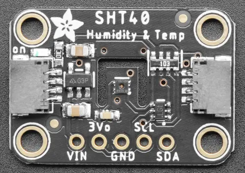

.. _adafruit_sht4x:

Adafruit SHT40 SHT41 and SHT45 Shields
######################################

Overview
********

The `Adafruit SHT40 SHT41 and SHT45 Shields`_ feature
a Sensirion SHT4x Humidity and Temperature Sensor and two STEMMA QT connectors.
It measures temperature and humidity. See for example the `SHT40 sensor`_.

   Adafruit SHT40 Shield (Credit: Adafruit)

Requirements
************

This shield can be used with boards which provide an I2C connector, for
example STEMMA QT or Qwiic connectors.
The target board must define a ``zephyr_i2c`` node label.
See :ref:`shields` for more details.

Pin Assignments
===============

+--------------+-------------------+
| Shield Pin   | Function          |
+==============+===================+
| SDA          | Sensor I2C SDA    |
+--------------+-------------------+
| SCL          | Sensor I2C SCL    |
+--------------+-------------------+

See :dtcompatible:`sensirion,sht4x` for details on possible devicetree settings,
for example regarding the trade-off between speed and repeatability.

This shield definition assumes an I2C address of 0x44.

Programming
***********

Set ``--shield adafruit_sht4x`` when you invoke ``west build``. For example
when running the :zephyr:code-sample:`dht_polling` sample:

.. zephyr-app-commands::
   :zephyr-app: samples/sensor/dht_polling
   :board: adafruit_feather_rp2040
   :shield: adafruit_sht4x
   :goals: build flash

.. _Adafruit SHT40 SHT41 and SHT45 Shields:
   https://learn.adafruit.com/adafruit-sht40-temperature-humidity-sensor

.. _SHT40 sensor:
   https://sensirion.com/products/catalog/SHT40
