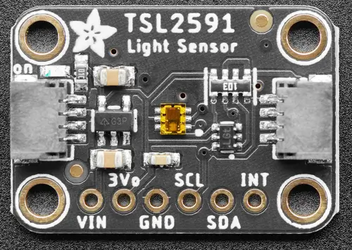

.. _adafruit_tsl2591:

Adafruit TSL2591 Shield
#######################

Overview
********

The `Adafruit TSL2591 High Dynamic Range Digital Light Sensor Shield`_ features
an `OSRAM TSL2591 Ambient Light Sensor`_ and two STEMMA QT connectors.

   Adafruit TSL2591 Shield (Credit: Adafruit)

Requirements
************

This shield can be used with boards which provide an I2C connector, for
example STEMMA QT or Qwiic connectors.
The target board must define a ``zephyr_i2c`` node label.
See :ref:`shields` for more details.

Pin Assignments
===============

+--------------+-----------------------+
| Shield Pin   | Function              |
+==============+=======================+
| SDA          | TSL2591 I2C SDA       |
+--------------+-----------------------+
| SCL          | TSL2591 I2C SCL       |
+--------------+-----------------------+
| INT          | TSL2591 interrupt out |
+--------------+-----------------------+

In order to use interrupts you need to connect a separate wire from the
shield to a GPIO pin on your microcontroller board. See
:dtcompatible:`ams,tsl2591` for documentation on how to adjust the
devicetree file.

Programming
***********

Set ``--shield adafruit_tsl2591`` when you invoke ``west build``.  For example
when running the :zephyr:code-sample:`light_sensor_polling` light measurement sample:

.. zephyr-app-commands::
   :zephyr-app: samples/sensor/light_polling
   :board: adafruit_qt_py_rp2040
   :shield: adafruit_tsl2591
   :goals: build

.. _Adafruit TSL2591 High Dynamic Range Digital Light Sensor Shield:
   https://learn.adafruit.com/adafruit-tsl2591

.. _OSRAM TSL2591 Ambient Light Sensor:
   https://ams-osram.com/products/sensor-solutions/ambient-light-color-spectral-proximity-sensors/ams-tsl25911-ambient-light-sensor
