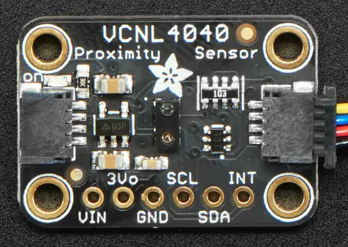

.. _adafruit_vcnl4040:

Adafruit VCNL4040 Shield
########################

Overview
********

The `Adafruit VCNL4040 Proximity and Lux Sensor Shield`_ features
a `Vishay VCNL4040 Proximity and Lux Sensor`_ and two STEMMA QT connectors.

   Adafruit VCNL4040 Shield (Credit: Adafruit)

Requirements
************

This shield can be used with boards which provide an I2C connector, for
example STEMMA QT or Qwiic connectors.
The target board must define a ``zephyr_i2c`` node label.
See :ref:`shields` for more details.

Pin Assignments
===============

+--------------+------------------------+
| Shield Pin   | Function               |
+==============+========================+
| SDA          | VCNL4040 I2C SDA       |
+--------------+------------------------+
| SCL          | VCNL4040 I2C SCL       |
+--------------+------------------------+
| INT          | VCNL4040 interrupt out |
+--------------+------------------------+

In order to use interrupts you need to connect a separate wire from the
shield to a GPIO pin on your microcontroller board. See
:dtcompatible:`vishay,vcnl4040` for documentation on how to adjust the
devicetree file.

Programming
***********

Set ``--shield adafruit_vcnl4040`` when you invoke ``west build``. For example
when running the :zephyr:code-sample:`vcnl4040` proximity and light sample:

.. zephyr-app-commands::
   :zephyr-app: samples/sensor/vcnl4040/
   :board: adafruit_qt_py_rp2040
   :shield: adafruit_vcnl4040
   :goals: build

.. _Adafruit VCNL4040 Proximity and Lux Sensor Shield:
   https://learn.adafruit.com/adafruit-vcnl4040-proximity-sensor

.. _Vishay VCNL4040 Proximity and Lux Sensor:
   https://www.vishay.com/en/product/84274/
